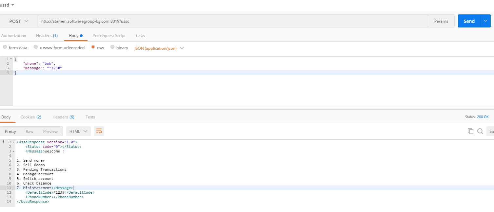

#E2E integration testing proposal.

E2E flows can be tested directly by simulating a sequence of ussd steps programatically. This could be achieved by sending `/POST` requests to `/ussd` . The body of the requests should be `application/json` cointaining the properties `phone` and `message`. e.g:

```
{
	"phone": "bob",
	"message": "*123#"
}
```

The response has a content-type: text/html; charset=utf-8. The `<Message>` field contains the text generated by the server formatted in the same way as it would be sent to the sms center (with spaces and new lines). E.g.



This way any flow can be emulated by consequently sending `/POST` requests to `/ussd` with the respective `phone` and `message` properties. Each ussd screen has its own logic which can be controlled by providing a specific message corresponding to the desired user input for any given case.
For example after going to the home screen,
sending {phone: 'bob', message: '1'} will go to the 'send money' screen

```
<UssdResponse version="1.0">
    <Status code="0"></Status>
    <Message>Enter destination number:

0. Home</Message>
    <DefaultCode>*123#</DefaultCode>
    <PhoneNumber></PhoneNumber>
</UssdResponse>
```

sending {phone: 'bob', message: '2'} will go to the 'sell goods' screen

```
<UssdResponse version="1.0">
    <Status code="0"></Status>
    <Message>To initiate the sale enter the user number of the buyer:

0. Home</Message>
    <DefaultCode>*123#</DefaultCode>
    <PhoneNumber></PhoneNumber>
</UssdResponse>
```

etc.
