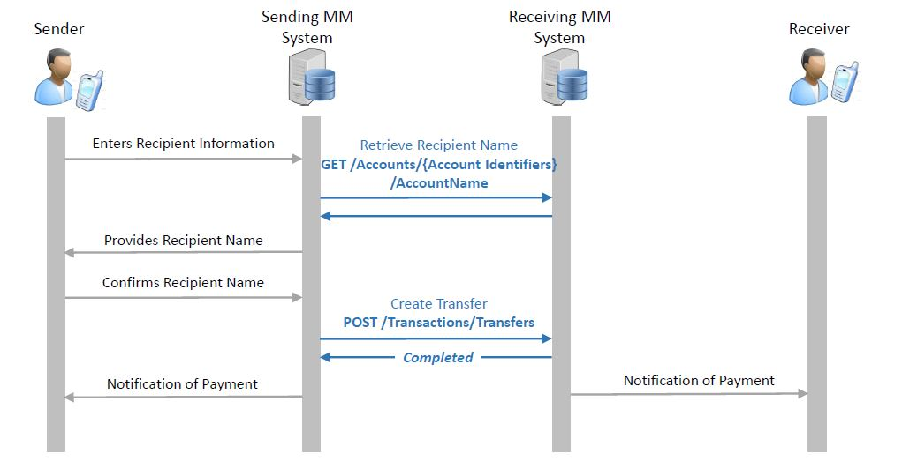
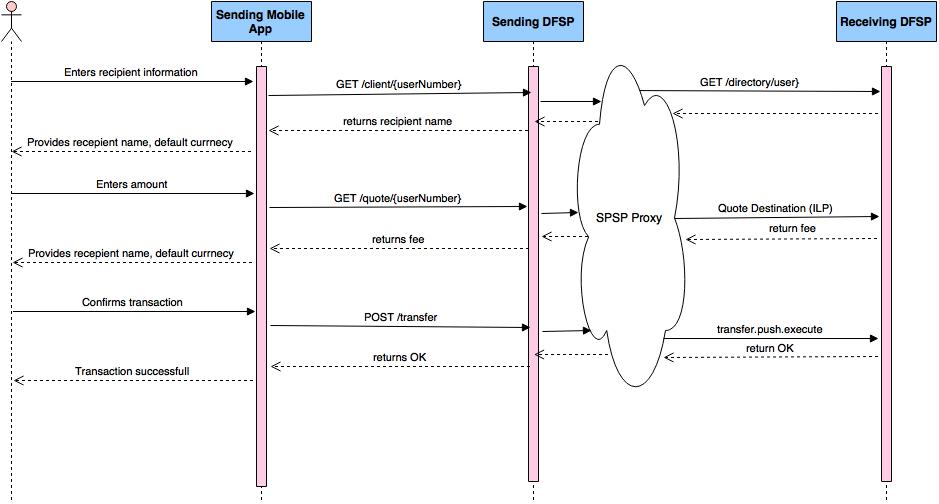
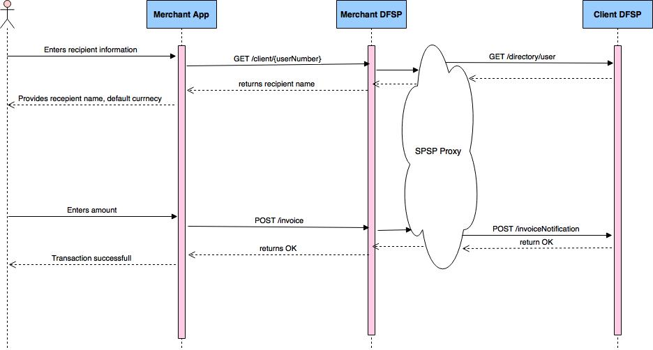
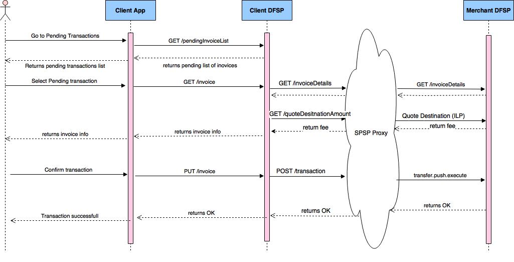

# Comparison between DFSP Over the Top and GSMA Mobile Money APIs

----------

## Document Introduction

This document offers a technical comparison between the Mobile Money API defined by GSMA and DFSP Over the Top API.

The purpose of the harmonized GSMA mobile money API is to support the movement of financial transactions between a mobile money service and a third party, and vice versa. Some other non-transactional use cases are also supported, for example enabling a debit mandate to be applied to an account.

DFSP Over the Top API exposes the DFSP functionalities for transactions processing, customer and account management, etc. to third party applications such as Android/IPhone smart application. There are additional set of APIs which are used for communication between DFSP to DFSP. Those APIs will not be analyzed in the current document.

##Use Case Summary

In this document you will find a comparison of the APIs that support the following two use cases:

- Person to Person (P2P) Push Transfer
- Merchant Purchase via Pending Transaction

##API Principles

Both DFSP and GSMA APIs are following the same high level principles:

 - Restful approach to API design
 - Based on JSON; no other content types are supported
 - Object model is abstracted from the underlying object representation
 - Asynchronous operations use a simple state object to support polling and call-back
 - Error Handling: consistent error codes with flexibility to provide specific parameters
 - Security:
	 - Client/Server Authentication via PKI
	 - HTTPs Basic Security Authentication
	 - Only GSMA API supports:
		 - JSON Web Encrtyption (JWE) for the message body
		 - JSON Web Signature (JWS)
		 - OAuth 2.0 to support multiple identity providers
		 

## Person to Person (P2P) Push Transfer

###1. GSMA Flow

###2. L1P Flow

##Comparison between API Methods

###1. Get Recipient Names

**GSMA MM provide 2 APIs to query for reception names based on the accountID or MSISDN**

[GET /accounts/{accountId}/accountname](https://gsma-harmonisation.symbox.com/swagger/#!/default/get_accounts_accountId_accountname)

[GET /accounts/msisdn/{msisdn}/accountname](https://gsma-harmonisation.symbox.com/swagger/#!/default/get_accounts_msisdn_msisdn_accountname)
    
MM GET /accounts API provides the names of the recipient. 

    

**L1P Over the Top API**

    GET /client/{userNumber}

Response:

    {
	    "id": "string",
	    "name": "string",
	    "currencyCode": "string",
	    "currencySymbol": "string",
    	"imageUrl": "URL"
     }
    
L1P API provides additionally information about the currency of the account, currency symbol with URL to the client photo. If the system is used only with USSD channel and with a single currency MM API can be used in L1P project.

###1. Get Quote

The purpose of this API call is to obtain the information about all fees, commissions, fx rate and other taxes associated with a certain transaction.   

**GSMA MM provide 3 APIs to query for quotation**

[POST /quotations](https://gsma-harmonisation.symbox.com/swagger/#!/default/post_quotations)

[GET /quotations/{quotationReference}](https://gsma-harmonisation.symbox.com/swagger/#!/default/get_quotations_quotationReference)

[PATCH /quotations/{quotationReference}](https://gsma-harmonisation.symbox.com/swagger/#!/default/patch_quotations_quotationReference)

Those APIs are intended to be used only for international transfers to get the fx rate and the fees associated with a transaction. There's no API that provides information about fees and commissions for a local transfer. 

**L1P Over the Top API**

    GET /quote/{userNumber}
    
    params:

    "currency": "USD",
    "amount": "money",

Response:

	{
    	"fee": money,
    	"commission": money
    }

The major difference between the APIs is that the L1P API is synchronous where the GSMA MM API is asynchronous. GSMA API do not provied information about the commission. 

###Transfer

**GSMA MM transaction API**

[POST /transactions](https://gsma-harmonisation.symbox.com/swagger/#!/default/post_transactions)

The POST /transaction API can be used for a wide range of use cases including P2P transfer, Merchant Payments, International Transfers, Domestic Transfers and agent cash-in/cash-out. Reversals and Adjustments are also treated as Transactions.
The API supports different currencies and can have different debit/credit party identifiers.

**L1P Over the Top API**

POST /transfer

Input Params:

	{
    	"sourceIdentifier": "string",
      	"sourceAccount": "string",
      	"destinationIdentifier": "string",
      	"destinationAmount": "money",
      	"currency": "USD",
      	"memo": "string"}"
    }
    

Response:

    {
      	"id": "uniqueidentifier",
  		"destinationAmount": "money",
  		"sourceAmount": "money",
      	"status": "enum (executed|pending|failed)"
    }

MM API is compatible with The L1P API.

###Conclusion

MM APIs can be used for L1P Person to Person (P2P) Push Transfer use case with the following limitations:

- GET /accounts method does not return information for the default currency of the recepient client.
- There is no straight forward API for obtaining the fees that the sender is going to pay for the transaction. The MM POST|GET /quotations API is intended to be used for international transfers. 

## Pending Transactions

###1. GSMA Flow

The documentation from GSMA MM API is not complete on this subject. It's not clear exactly how the pending transaction is created via the POST /transaction method. Also the payment request and the payment response methods show on the diagram are not a part of the GSMA MM API specification. Our assumption is that a pending transaction is created, somehow the client which is debited is notified and when he approves it, the transaction is cleared and goes to completed state. 

###2. L1P Flow

**1. Create Pending Transaction Flow**

**2. Approve Pending Transaction Flow**

L1P approach is different from the one taken by GSMA MM API. Creating of pending transaction (we called that invoice creation) is not a part of the transaction flow. The invoice is created at the merchant's side and the client is notified about it. When the client wants to pay the pending transaction the details are get from the merchant's DFSP and with those details a push payment is initiated.

  
**GSMA MM transaction API**

[POST /transactions](https://gsma-harmonisation.symbox.com/swagger/#!/default/post_transactions)

It is not clear for GSMA documentation how to create a pending transaction

**L1P Over the Top APIs**

1. POST /invoice - create an invoice in the merchant's DFSP
2. GET /pendingInvoiceList - gets a list of pending transactions to be displayed 
3. GET /invoice - gets detailed information about an invoice
4. PUT /invoice - pays an invoice

###Conclusion
It's not clear how to match between GSMA MM transaction API and functionally that L1P provides in regards to pending transactions and approving of pending transactions. It seems that there is a gap here in GSMA MM protocol that should be filled in.