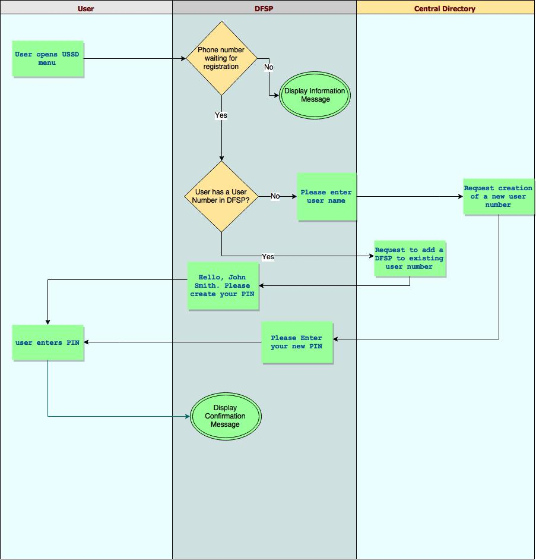

# Manage Account Holders

DFSP system should allow one account to have multiple account holders.

Each account holder, in relation with account could be
either signatory or non-signatory.

Signatory account holders will have full rights over the account and can do push transfer, sell good, approve pending transaction, rename account, check balance, check mini-statement operations, add account holders, remove account holders.

Non-signatory account will have the option to check the balance, check mini statement and sell goods.

## Adding an Account Holder

Adding an account holder can be done only by another signatory account holder.

When a new account holder is added to an account the identification of the user will be done with his user number in case the user has one.

### Scenarios

- The new account holder does not have a user number. In this case DFSP will ask the user to enter the new account holder phone number and ask whether the new account holder will be a signatory or a non-signatory. The new account holder should go through a registration process.

- The new account holder does have an existing user number, but is not registered within the DFSP. In this case DFSP verifies that the user number exists in the central directory and gets the name from there. DFSP will ask the user to enter the new account holder phone number and ask whether the new account holder will be a signatory or a non-signatory. The new account holder should go through the registration process

- The new account holder does have an existing number and is registered within the DFSP. In this case the system will ask whether the new account holder will be a signatory or a non-signatory. The system will add the new account holder and his primary account will not be changed.

The following diagram shows the process business flow.

## Registering a new account holder

Registration process for the new account holders is required when those are not registered within the DFSP in which the user is added as an account holder.

The process starts when the new DFSP user dials the USSD menu. The DFSP will recognize by the phone number of the user that the one is attached as an account holder. The process has 2 cases:

- The user already has a user number but is not registered within the current DFSP. In this case the system will display his name and ask the user to create his new PIN. Then the system will display a confirmation message. In this case the primary DFSP of the user will not be changed.

- The user does not have a user number. In this case DFSP will ask the user to enter his name, them will query the central directory and request a new user number to be created and finally the system will ask the user to create his new PIN.

The business diagram of the process can be seen below:

## Removing an account holder

An account holder can be removed as such only by a signatory account holder for the same account.
Removing an account holder will just remove the link between the account and the user and will not change the account itself (e.g. will not close it).
In case there is only one signatory account holder for a account, it will not be possilbe to be removed.

The account holders will be presented in the USSD menu by their name. Only in case there's a pending registration process fo a new account holder which does not have a user number, he will be presented on the USSD menu by his phone number.

Removing the account holder process will happen by simply selecting an account holder that has to be removed and confirm the operation via PIN.

In case that the account holder is removed from an account that is a primary for him, the oldest registered account that he has will become a primary one.

In case the account holder which is removed left without accounts, he will see only the menu 'manage accounts' and will be able to create own account.

## Viewing account holders

All the account holders should be available from 'account information' page. The signatory account holders should be marked there as well.

## Changing the primary DFSP

Each user in the system has a primary DFSP. The primary DFSP is kept in the central directory and is used when somebody sends money to a user, identified by a user number, the system to determine to which DFSP the money should be send to.

As a security measure the primary DFSP could be changed only from the primary DFSP for the user.

The process for changing the primary DFSP will start by displaying all available DFSPs that the user has accounts. The user could select a DFSP the he would like to be a primary one and confirm the operation via PIN. The DFSP will update the central directory with this change.

## Changed and new APIs in the Central Directory

### Register a new DFSP in the central directory.

The registration process for a new DFSP should be improved. When a new DFSP is registered the following parameters should be passed:

- Short DFSP Name (needed for the process for changing the primary DFSP)
- SPSP Server URL (improvement - instead of passing this URL every time when a new user is added in the central directory, it can be passed upon DFSP registration)

As a response the central directory should generate username/password for the DFSP and send back.

### Get user number information

This API will return the name of the user, the primary DFSP and the DFSPs associated with a user number.
Input parameters:

- User Number

Response:

- Name of the User
- Default DFSP SPSP server URL
- Default DFSP name
- Array of names and urls for all DFSPs attached the user number  

### Register a new user in the central directory.

Registration process for a new user should be improved. There's no need to pass every time the SPSP server URL address, because the DFSP authenticate and the central directory should already has that information provided by the previous API.

There should be the following input parameters to the request:

- Name of the user

As a response the central directory should generate a user number and send it back.

### Add DFSP to user number

Central directory should keep information about all the DFSPs that a user number is registered with, not only the primary DFSP for a user number. We need this information for changing primary DFSP use case.

There should be an option to add DFSP to a user number. Only the authenticated DFSP can send a request do be added to a user number.
There shouldn't be any input parameters to this API. As a response there should be confirmation or error.

### Remove DFSP from user number

There should be an option for removing the DFSP from a user number.

As input parameter the API should expect:

- User Number
- DFSP name that should be removed

** Note ** Central directory will not allow a primary DFSP to be removed from a user number.

As a response there should be confirmation or an error message.

### Make a DFSP the primary one for a user number

There should be an API that can make a DFSP primary. Only the DFSP that is currently a primary one for a user number should be able to do a change.
As input parameter to the API should expect:

- User Number
- DFSP name that should become the primary
As a response there should be confirmation or an error message.
