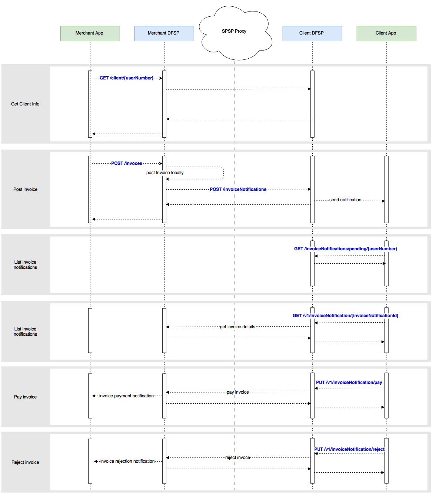

# Pending Transfers API

-----

## I. Summary  ##

Creating and paying or rejecting pending transfers using the DFSP Over the Top API.

In real life, this flow can be seen for merchant purchase use case where a merchant sells goods to customer and both of them have mobile (smart) phones.
From end user's perspective the use case looks like this:

1. Merchant log in his smart application and select 'merchant purchase' option.
2. Merchant enters the customer identification (phone number or user number) or selects it from a list (for regular customers visiting his shop).
3. The Merchant enters the amount that the customer has to pay and confirms the operation
4. The system creates an 'invoice' for that amount into merchant's DFSP and send a notification to the customer that he has a pending invoice.
5. The customer log in his smart application and see the pending notification that he can pay or reject. He also can go to pending invoices menu where he can see a list of all the pending invoices for him.
6. The customer selects an invoice that he is going to pay and the system loads all the details for the invoice, together with the fee associated with the transaction.
7. The customer can pay or reject this pending invoice. Upon paying the customer has to authenticate the transaction (i.e in case the application is configured to use 2 factor authentication), the customer initiate the payment and the merchant gets notification that the invoice has been payed successfully.


The API exposes the DFSP functionalities for transfers processing, customer and account management, etc. to third party applications such as Android/IPhone smart application. There are additional set of APIs which are used for communication between DFSP to DFSP. Those APIs will not be analyzed in the current document.

**API Principles**

  * Restful approach to API design.
  * Based on JSON, no other content types are supported.

  


## II. Assumptions  ##

   * Merchant is the party sending the invoices.
   * Client is the party who is receiving the invoices and is able to pay/reject them.
   * The merchant and the client are in different systems.
   * The merchant and the client are logged in to their systems.
   * Security is not a part of this specification.
   * Getting information about the customer accounts is not a part of this specification.
   * Notifications are not a part of this specification, as each platform provides different means for that (e.g. Google Firebase notification services, SMS notification, email notification, etc.).


## III.  Get Client Information  ##

This API will return the information about a client (his first name, last name and a photo) based on client identification such as user number or phone number.

### API Description

----


* **URL**

  `/v1/client/{userNumber}`

* **Method**

  `GET`

*  **URL Params**
   * `userNumber - The number of the user`

* **Sample Call**

  ```
    curl -X GET --header 'Accept: application/json' 'http://host/v1/client/78956562'
  ```

* **Success Response**

  * **Code:** 200 <br />
    **Content**

     * `firstName [string] - Client's first name`
     * `lastName [string] - Client's last name`
     * `imageUrl [string] - Link to the client's image`

* **Sample Response**

  ```
    {
      "firstName": "Bob",
      "lastName": "Smith",
      "imageUrl": "https://red.ilpdemo.org/api/receivers/bob?securityKey=497a2af553cc1cc6443692c6eed60ebda1a08020d287c4f5461a1e41d840d6f5"
    }
  ```
* **Error handling**

  * **Code:** 401 <br />
  **Content**
  ```
    {
      "id": "Unauthorized",
      "message": "Access is denied due to invalid credentials"
    }
  ```  

  * **Code:** 404 <br />
  **Content**
  ```
    {
      "id": "ClientNotFound",
      "message": "Client userNumber could not be found"
    }
  ```


## IV.  Create Invoice  ##

This API will create an invoice in the merchant's DFSP and will send notification to the client's DFSP. The invoice is created into the merchant's DFSP associated with a merchant's account. Thus then the invoice is paid the money will go into the associated account. The client's DFSP upon receiving the invoice notification can send it to the third party application via SMS, Google Notification service, etc. It is recommended that the invoice reference in the client's DFSP will not be associated with any clients account thus the client can choose an account from which he is going to pay the invoice.

### API Description
----


* **URL**

  `/v1/invoices`

* **Method**

  `POST`

* **Data Params**

  **Required**

   * `account [string] - Invoice merchant's account`
   * `amount [number] - Invoice amount`
   * `userNumber [string] - Client's user number`

   **Optional**

   * `info [string] - Additional invoice information`

* **Sample Call**

  ```
    curl -X POST --header 'Content-Type: application/json' --header 'Accept: application/json' -d
    '{
      "account": "merchant",
      "amount": 123,
      "userNumber": "78956562",
      "info": "Invoice from merchant to Alice"
    }'
    'http://host/v1/invoices'
  ```

* **Success Response**

  * **Code:** 200 <br />
    **Content**
       * `invoiceId [number] - Invoice id`
       * `account [string] - Invoice merchant's account`
       * `firstName [string] - Merchant's first name`
       * `lastName [string] - Merchant's last name`
       * `currencyCode [string] - Invoice merchant's currency code`
       * `currencySymbol [string] - Invoice merchant's currency symbol`
       * `amount [string] - Invoice amount`
       * `status [string] - Invoice status`
       * `userNumber [string] - Invoice client's user number`
       * `info [string] - Invoice additional information`  

 * **Note** Invoice status can be one of the following:
     * paid  
     * pending  
     * rejected  

* **Sample Response**

  ```
    {
      "invoiceId": 1,
      "account": "merchant",
      "firstName": "John",
      "lastName": "Smith",
      "currencyCode": "USD",
      "currencySymbol": "$",
      "amount": "130.34",
      "status": "pending",
      "userNumber": "78956562",
      "info": "Invoice from merchant for 130.34 USD"
    }
  ```
* **Error handling**

  * **Code:** 401 <br />
  **Content**
  ```
    {
      "id": "Unauthorized",
      "message": "Access is denied due to invalid credentials"
    }
  ```  

  * **Code:** 404 <br />
  **Content**
  ```
    {
      "id": "ClientNotFound",
      "message": "Client userNumber could not be found"
    }
  ```  

  * **Code:** 404 <br />
  **Content**
  ```
    {
      "id": "MerchantNotFound",
      "message": "Merchant account could not be found"
    }
  ```  


## V.  Pending Invoice Notifications ##

Client will be able to obtain a list of all the pending invoices. This API is optional for the use case. Depending on the implementation it can be useful in case the third party application implements an option for the client to list all the pending invoices that the client has.

### API Description

----


* **URL**

  `/v1/invoiceNotifications/pending/{userNumber}`

* **Method*

  `GET`

*  **URL Params**

   * `userNumber - Client's user number`

* **Sample Call**

  ```
    curl -X GET --header 'Accept: application/json' 'http://host/v1/invoiceNotifications/pending/78956562'
  ```

* **Success Response**

  * **Code:** 200 <br />
    **Content**
       * `invoiceNotificationId [number] - Invoice notification id`
       * `status [string] - Invoice notification status`
       * `info [string] - Additional invoice notification information`  

* **Note** Invoice notification status can be one of the following:

     * paid  
     * pending  
     * rejected  

* **Sample Response**

  ```
    {
      "invoices": [
        {
          "invoiceNotificationId": 2,
          "status": "pending",
          "info": "Invoice from merchant for 130.34 USD"
        }
      ]
    }
  ```  

* **Error handling**

  * **Code:** 401 <br />
  **Content**
  ```
    {
      "id": "Unauthorized",
      "message": "Access is denied due to invalid credentials"
    }
  ```  

  * **Code:** 404 <br />
  **Content**
  ```
    {
      "id": "ClientNotFound",
      "message": "Client userNumber could not be found"
    }
  ```  

* **<a href="http://ec2-35-163-249-3.us-west-2.compute.amazonaws.com:8010/documentation?tags=getInvoiceNotificationList" target="_blank">Try it out here</a>**


## VI.  Get Payment Details by Invoice Notification  ##

This API will return to the client all the details associated with the payment for a certain invoice such as the details about the merchant (first name, last name) and the fee associated with the transaction.

### API Description

----


* **URL**

  `/v1/invoicesNotifications/{invoiceNotificationId}`

* **Method**

  `GET`

*  **URL Params**

   * `invoiceNotificationId - Invoice notification id`

* **Sample Call**

  ```
    curl -X GET --header 'Accept: application/json' 'http://host/v1/invoiceNotifications/2'
  ```

* **Success Response**

  * **Code:** 200 <br />
    **Content**
       * `firstName [string] - Merchant's first name`
       * `lastName [string] - Merchant's last name`
       * `amount [number] - Invoice amount`
       * `currencyCode [string] - Currency code`
       * `currencySymbol [string] - Currency symbol`
       * `fee [number] - Transfer fee`

* **Sample Response**

  ```
    {
      "firstName": "Ben",
      "lastName": "Smith",
      "amount": 123,
      "currencyCode": "USD",
      "currencySymbol": "$",
      "fee": 1.23,
    }
  ```

* **Error handling**

  * **Code:** 401 <br />
  **Content**
  ```
    {
      "id": "Unauthorized",
      "message": "Access is denied due to invalid credentials"
    }
  ```  

  * **Code:** 404 <br />
  **Content**
  ```
    {
      "id": "InvoiceNotificationNotFound",
      "message": "Invoice notification with such invoiceNotificationId could not be found"
    }
  ```  

* **<a href="http://ec2-35-163-249-3.us-west-2.compute.amazonaws.com:8010/documentation?tags=getInvoiceInfo" target="_blank">Try it out here</a>**


## VII.  Pay Invoice  ##

This API will be used by the client's application to request a payment for the invoice. Upon successful payment, merchant's DFSP will mark the invoice as paid and the merchants application should get an invoice payment notification (outside the scope of the current document).

### API Description
----

* **URL**

  `/v1/invoiceNotifications/pay`

* **Method**

  `PUT`

* **Data Params**

  **Required**

   * `account [string] - Client's account`
   * `invoiceNotificationId [string] - Invoice notification id`

* **Sample Call**

  ```
    curl -X PUT --header 'Content-Type: application/json' --header 'Accept: application/json' -d
    '{
      "account": "bob",
      "invoiceNotificationId": "6"
    }'
    'http://host/v1/invoiceNotifications/pay'
  ```

* **Success Response**

  * **Code:** 200 <br />
    **Content**
      * `invoiceNotificationId [string] - Invoice notification id`
      * `status [string] - Invoice notification status`  

* **Note** Invoice notification status can be one of the following:

     * paid  
     * pending  
     * rejected  

* **Sample Response**

  ```
    {
      "invoiceNotificationId": "3",
      "status": "paid",
    }
  ```

  * **Error handling**

  * **Code:** 400 <br />
  **Content**
  ```
    {
      "id": "InvoiceNotificationNotFound",
      "message": "Invoice notification with such invoiceNotificationId could not be found"
    }
  ```  
  * **Code:** 401 <br />
  **Content**
  ```
    {
      "id": "Unauthorized",
      "message": "Access is denied due to invalid credentials"
    }
  ```  

  * **Code:** 500 <br />
  **Content**
  ```
    {
      "id": "InsufficientFunds",
      "message": "You do not have sufficient funds to pay the inoice"
    }
  ```

* **<a href="http://ec2-35-163-249-3.us-west-2.compute.amazonaws.com:8010/documentation?tags=payInvoiceNotification" target="_blank">Try it out here</a>**


## VIII.  Reject Invoice  ##

Client also will be able to reject invoices. In most of the cases this API will be used to instruct the client's DFSP to remove this invoice notification from the client's list and to send the reject notification to the merchant's DFSP.

### API Description
----

* **URL**

  `/v1/invoiceNotifications/reject`

* **Method**

  `PUT`

* **Data Params**

  **Required**

   * `invoiceNotificationId [string] - Invoice notification id`

* **Sample Call**

  ```
    curl -X PUT --header 'Content-Type: application/json' --header 'Accept: application/json' -d
    '{
       "invoiceNotificationId": "2"
    }'
    'http://host/v1/invoiceNotifications/reject'
  ```

* **Success Response**

  * **Code:** 200 <br />
    **Content**
      * `invoiceNotificationId [string] - Invoice notification id`
      * `status [string] - Invoice notification status`

* **Note** Invoice notification status can be one of the following:

     * paid  
     * pending  
     * rejected

* **Sample Response**

  ```
    {
      "invoiceNotificationId": "2",
      "status": "rejected",
    }
  ```

 * **Error handling**

  * **Code** 400 <br />
  **Content**
  ```
    {
      "id": "InvoiceNotificationNotFound",
      "message": "Invoice notification with such invoiceNotificationId could not be found"
    }
  ```  
  * **Code:** 401 <br />
  **Content**
  ```
    {
      "id": "Unauthorized",
      "message": "Access is denied due to invalid credentials"
    }
  ```  

* **<a href="http://ec2-35-163-249-3.us-west-2.compute.amazonaws.com:8010/documentation?tags=rejectInvoiceNotification" target="_blank">Try it out here</a>**
