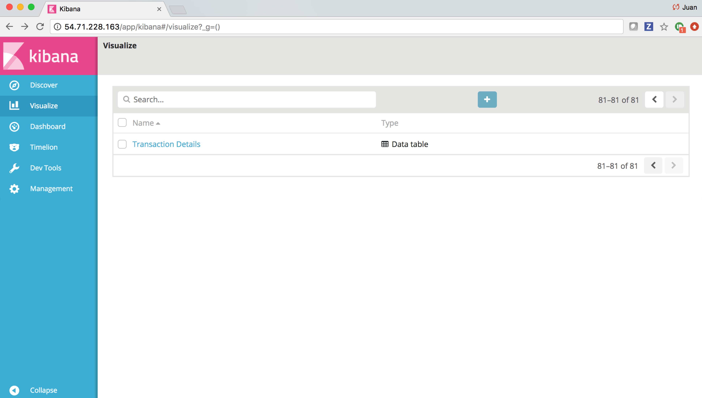
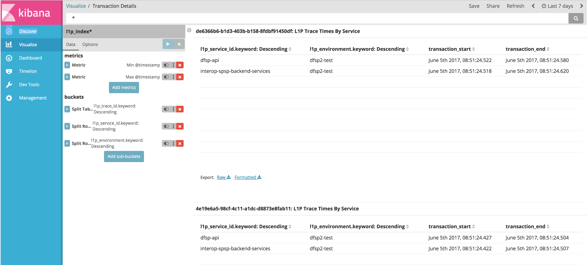

# Logging Setup

Steps to perform ELK 5.X Stack Installation in AWS EC2 Instance RHEL

## JDK 8 Installation
==================

> If not already installed JDK 8 must be installed to continue with the
> ELK 5.X Setup.

### Install wget to download JDK 8 rpm

> \# yum -y install wget

### Download JDK 8 rpm

> wget --no-cookies --no-check-certificate --header "Cookie:
> gpw\_e24=http%3A%2F%2Fwww.oracle.com%2F;
> oraclelicense=accept-securebackup-cookie"
> <http://download.oracle.com/otn-pub/java/jdk/8u121-b13/e9e7ea248e2c4826b92b3f075a80e441/jdk-8u121-linux-x64.rpm>

### Check JDK 8 rpm sha256 sum

> \# sha256sum jdk-8u121-linux-x64.rpm

### Compare JDK 8 rpm sha256 sum against

> [https://www.oracle.com/webfolder/s/digest/**8u121**checksum.html](https://www.oracle.com/webfolder/s/digest/8u121checksum.html)

### Install JDK 8 rpm

> \# rpm -ivh jdk-8u121-linux-x64.rpm

### Set Java default

> java –version
>
> If not 1.8.0\_121, make it your default java using the alternatives
> command:
>
> sudo alternatives –config java
>
> Enter the selection number to choose which java executable should be
> used by default.

## Elasticsearch Installation
---------------
### Import Elasticsearch PGP Key

> \# rpm --import <https://artifacts.elastic.co/GPG-KEY-elasticsearch>

Create file with elasticsearch repository information
------------------------------------------------------

> \# vi /etc/yum.repos.d/elasticsearch.repo
>
> Add following contents:
>
> \[elasticsearch-5.x\]
>
> name=Elasticsearch repository for 5.x packages
>
> baseurl=https://artifacts.elastic.co/packages/5.x/yum
>
> gpgcheck=1
>
> gpgkey=https://artifacts.elastic.co/GPG-KEY-elasticsearch
>
> enabled=1
>
> autorefresh=1
>
> type=rpm-md

### Install elasticsearch

> \# yum –y install elasticsearch

### Configure elasticsearch

> \# sudo vim /etc/elasticsearch/elasticsearch.yml
>
> Go to Network section and modify the network.host:
>
> network.host: \[\_eth0\_, \_local\_\]

### Start/Stop/Restart elasticsearch

> sudo service elasticsearch start
>
> sudo service elasticsearch stop
>
> sudo service elasticsearch restart

### Make elasticsearch more verbose by removing the “-- quite \\” flag

> \# vi /usr/lib/system/system/elasticsearch.service

### Restart elasticsearch service and perform daemon reload

> sudo service elasticsearch restart

### Check that elasticsearch is running

> Install netcat if not already install for debugging purposes:
>
> \# yum –y install nmap-ncat
>
> \#ncat –v **localhost** 9200
>
> Ncat: Version 6.40 ( http://nmap.org/ncat )
>
> Ncat: Connected to ::1:9200.
>
> **GET /**
>
> HTTP/1.0 404 Not Found
>
> es.index\_uuid: \_na\_
>
> es.resource.type: index\_or\_alias
>
> es.resource.id: bad-request
>
> es.index: bad-request
>
> content-type: application/json; charset=UTF-8
>
> content-length: 367
>
> {"error":{"root\_cause":\[{"type":"index\_not\_found\_exception","reason":"no
> such
> index","resource.type":"index\_or\_alias","resource.id":"bad-request","index\_uuid":"\_na\_","index":"bad-request"}\],"type":"index\_not\_found\_exception","reason":"no
> such
> index","resource.type":"index\_or\_alias","resource.id":"bad-request","index\_uuid":"\_na\_","index":"bad-request"},"status":404}
>
> If localhost is not the hostname, specify correct hostname or use
> server ip here. Also, must type “**GET \\**”**.**
>
> Can also use curl command to check that elasticsearch is running:
>
> \# curl -X GET http://localhost:9200/

## Kibana Installation

### Install kibana

> \# yum –y install kibana

### Configure Kibana

> \# vi /etc/kibana/kibana.yml
>
> Uncomment and make sure to set the following 4 entries:
>
> server.port: 5601
>
> server.host: " localhost"
>
> server.name: "localhost"
>
> elasticsearch.url: <http://localhost:9200>
>
> NOTE: localhost needs to be replaced by the actual hostname or server
> ip depending on ELK stack configuration, currently entire ELK stack is
> running on the same server.

### Start/Stop/Restart Kibana

> sudo service kibana start
>
> sudo service kibana stop
>
> sudo service kibana restart

### Verify that you Kibana can be accessed from the browser

> <http://localhost:5601/app/kibana>
>
> NOTE: localhost needs to be replaced by the actual hostname or server
> ip. If no UI is available, go to NGINX reverse proxy section to access
> Kibana.

### Verify Kibana status from the browser

> <http://localhost:5601/status>
>
> NOTE: If no UI installed, continue to NGINX reverse proxy installation
> section to access Kibana from the browser.

## Logstash Installation

NOTE: Currently not installed as Beat log shippers (Filebeat and
Metricsbeat) are directly sending logs to Elasticsearch. Logstash can be
used to perform processing of logs. For more information, look at
Additional Considerations section.

### Install Logstash

> \# yum –y install logstash

### Start/Stop/Restart Logstash

> sudo service kibana start
>
> sudo service kibana stop
>
> sudo service kibana restart
>
> **Example Logstash Configuration to read system logs
> (/var/logs/\*log)**
>
> input {
>
> file {
>
> type =&gt; "syslog"
>
> path =&gt; \[ "/var/log/messages", "/var/log/\*.log" \]
>
> }
>
> }
>
> output {
>
> stdout {
>
> codec =&gt; rubydebug
>
> }
>
> elasticsearch {
>
> host =&gt; "localhost" \# Use the internal IP of your Elasticsearch
> server
>
> \# for production
>
> }
>
> }

### BEST PRACTICES

**-**Separate large Logstash configuration files into several smaller
ones. Conf file path can be set to a directory. Files in directory will
be merged by name, therefore name logstash configuration files in
alphabetical order.

-Configure Filebeat to feed Logstash and Logstash to feed Elasticsearch.

## Filebeat Installation

### Install Filebeat

> \# yum –y install filebeat

### Configure Filebeat

vi /etc/filebeat/filebeat.yml

Configure Filebeat to ship files to Elasticsearch:

Under Elasticsearch output section modify

hosts: \["http://172.31.45.32:9200"\]

NOTE: Use the eth0 ip where Elasticsearch is running.

Configure path for Filebeat to crawl and fetch logs from:

Under Filebeat prospectors section, identify paths and for example add

- /var/log/mule\_logs/mule\_dfsp1/\*.log

Start/Stop/Restart Filebeat
----------------------------

> sudo service filebeat start
>
> sudo service filebeat stop
>
> sudo service filebeat restart

### Import dashboars and index

> /usr/share/filebeat/scripts/import\_dashboards

### Logstash vs Beats

Beats are lightweight data shippers that you install as agents on your
servers to send specific types of operational data to Elasticsearch.
Beats have a small footprint and use fewer system resources than
Logstash.

Logstash has a larger footprint, but provides a broad array of input,
filter, and output plugins for collecting, enriching, and transforming
data from a variety of sources.

Beats are lightweight data shippers that you install as agents on your
servers to send specific types of operational data to Elasticsearch.
Beats have a small footprint and use fewer system resources than
Logstash.

Logstash has a larger footprint, but provides a broad array of input,
filter, and output plugins for collecting, enriching, and transforming
data from a variety of sources.

Among Logstash filters that can be leveraged at L1P are; anonymize,
json.

## Metricbeat Installation

### Install Metricbeat

> \# yum –y install metricbeat

### Configure Metricbeat

vi /etc/metricbeat/metricbeat.yml

Configure Metricbeat to ship files to Elasticsearch:

Under Elasticsearch output section modify

hosts: \["http://172.31.45.32:9200"\]

NOTE: Use the eth0 ip where Elasticsearch is running.

### Start/Stop/Restart Metricbeat

> sudo service metricbeat start
>
> sudo service metricbeat stop
>
> sudo service metricbeat restart

### Import dashboars and index

> /usr/share/metricbeat/scripts/import\_dashboards

## NGINX Reverse Proxy Installation
================================

### Install NGINX

> yum -y install nginx httpd-tools

### Create password file for basic authentication of http users

htpasswd -c /etc/nginx/conf.d/kibana.htpasswd admin

### Configure NGINX

> vi /etc/nginx/conf.d/kibana.conf
>
> server {
>
> listen 80;
>
> server\_name localhost;
>
> auth\_basic "Restricted Access";
>
> auth\_basic\_user\_file /etc/nginx/htpasswd.users;
>
> location / {
>
> proxy\_pass http://localhost:5601;
>
> proxy\_http\_version 1.1;
>
> proxy\_set\_header Upgrade \$http\_upgrade;
>
> proxy\_set\_header Connection 'upgrade';
>
> proxy\_set\_header Host \$host;
>
> proxy\_cache\_bypass \$http\_upgrade;
>
> }
>
> }

### Restart NGINX

> sudo service kibana restart

### Access Kibana via NGINX on your browser

> <http://EC2_INSTANCE_URL>
>
> Enter username/password admin/adminpassword

## Modify AWS EC2 Instance Security Group to open ports

### Create Two Inbound rules

1.  tcp for port 80 for NGINX

2.  tcp for port 9200 for Elasticsearch, can ben only opened for
    Beats/Logstash servers

## Kibana Query

<https://www.elastic.co/guide/en/kibana/current/search.html>

<https://www.mjt.me.uk/posts/kibana-101/>

<https://www.timroes.de/2016/05/29/elasticsearch-kibana-queries-in-depth-tutorial/>

<http://logz.io/blog/kibana-tutorial/>

To perform Kibana Queries log into kibana. Make sure to set proper Time Range at
Kibana-&gt;Discover on top right hand corner. Simply enter query and
search.

## Custom L1P_Index Configuration

The custom L1P_Index is defined by the two files show below (ilp_template.json and types.json) which are part of the interop-elk GitHub repo. The L1P_Index is an elasticsearch index used as the storage data structure for the L1P specific log data. The main purpose is to capture and display L1P transaction timestamp across L1P components. 

ilp_template.json:

>{
>
>  "template": [
>
>    "l1p_index*"
>
>  ],
>
>  "mappings": {
>
>    "l1p_log": {
>
>      "_all": {
>
>        "norms": false
>
>      },
>
>      "dynamic_templates": [
>
>        {
>
>          "strings_as_keyword": {
>
>            "match_mapping_type": "string",
>
>            "mapping": {
>
>              "ignore_above": 1024,
>
>              "type": "keyword"
>
>            }
>
>          }
>
>        }
>
>      ],
>
>      "properties": {
>
>        "@timestamp": {
>
>          "type": "date"
>
>        },
>
>        "l1p_trace_id": {
>
>          "type": "keyword"
>
>        },
>
>        "beat": {
>
>          "properties": {
>
>            "hostname": {
>
>              "type": "keyword",
>
>              "ignore_above": 1024
>
>            },
>
>            "name": {
>
>              "type": "keyword",
>
>              "ignore_above": 1024
>
>            },
>
>            "version": {
>
>              "type": "keyword",
>
>              "ignore_above": 1024
>
>            },
>
>            "processing_timestamp": {
>
>              "type": "date"
>
>            }
>
>          }
>
>        },
>
>        "input_type": {
>
>          "type": "keyword",
>
>          "ignore_above": 1024
>
>        },
>
>        "message": {
>
>          "type": "text",
>
>          "norms": false
>
>        },
>
>        "meta": {
>
>          "properties": {
>
>            "cloud": {
>
>              "properties": {
>
>                "availability_zone": {
>
>                  "type": "keyword",
>
>                  "ignore_above": 1024
>
>                },
>
>                "instance_id": {
>
>                  "type": "keyword",
>
>                  "ignore_above": 1024
>
>                },
>
>                "machine_type": {
>
>                  "type": "keyword",
>
>                  "ignore_above": 1024
>
>                },
>
>                "project_id": {
>
>                  "type": "keyword",
>
>                  "ignore_above": 1024
>
>                },
>
>                "provider": {
>
>                  "type": "keyword",
>
>                  "ignore_above": 1024
>
>                },
>
>                "region": {
>
>                  "type": "keyword",
>
>                  "ignore_above": 1024
>
>                }
>
>              }
>
>            }
>
>          }
>
>        },
>
>        "offset": {
>
>          "type": "long"
>
>        },
>
>        "source": {
>
>          "type": "keyword",
>
>          "ignore_above": 1024
>
>        },
>
>        "tags": {
>
>          "type": "keyword",
>
>          "ignore_above": 1024
>
>        }
>
>      }
>
>    }
>
>  }
>
>}
>

types.json

>{
>
>  "l1p_index": {
>
>    "mappings": {
>
>      "l1p_log": {
>
>        "_all": {
>
>          "norms": false
>
>        },
>
>        "dynamic_templates": [
>
>          {
>
>            "strings_as_keyword": {
>
>              "match_mapping_type": "string",
>
>              "mapping": {
>
>                "ignore_above": 1024,
>
>                "type": "keyword"
>
>              }
>
>            }
>
>          }
>
>        ],
>
>        "properties": {
>
>          "@timestamp": {
>
>            "type": "date"
>
>          },
>
>          "ilp_trace_id": {
>
>            "type": "keyword"
>
>          },
>
>          "beat": {
>
>            "properties": {
>
>              "hostname": {
>
>                "type": "keyword",
>
>                "ignore_above": 1024
>
>              },
>
>              "name": {
>
>                "type": "keyword",
>
>                "ignore_above": 1024
>
>              },
>
>              "version": {
>
>                "type": "keyword",
>
>                "ignore_above": 1024
>
>              },
>
>              "processing_timestamp": {
>
>                "type": "date"
>
>              }
>
>            }
>
>          },
>
>          "input_type": {
>
>            "type": "keyword",
>
>            "ignore_above": 1024
>
>          },
>
>          "message": {
>
>            "type": "text",
>
>            "norms": false
>
>          },
>
>          "meta": {
>
>            "properties": {
>
>              "cloud": {
>
>                "properties": {
>
>                  "availability_zone": {
>
>                    "type": "keyword",
>
>                    "ignore_above": 1024
>
>                  },
>
>                  "instance_id": {
>
>                    "type": "keyword",
>
>                    "ignore_above": 1024
>
>                  },
>
>                  "machine_type": {
>
>                    "type": "keyword",
>
>                    "ignore_above": 1024
>
>                  },
>
>                  "project_id": {
>
>                    "type": "keyword",
>
>                    "ignore_above": 1024
>
>                  },
>
>                  "provider": {
>
>                    "type": "keyword",
>
>                    "ignore_above": 1024
>
>                  },
>
>                  "region": {
>
>                    "type": "keyword",
>
>                    "ignore_above": 1024
>
>                  }
>
>                }
>
>              }
>
>            }
>
>          },
>
>          "offset": {
>
>            "type": "long"
>
>          },
>
>          "source": {
>
>            "type": "keyword",
>
>            "ignore_above": 1024
>
>          },
>
>          "tags": {
>
>            "type": "keyword",
>
>            "ignore_above": 1024
>
>          },
>
>          "type": {
>
>            "type": "keyword",
>
>            "ignore_above": 1024
>
>          }
>
>        }
>
>      }
>
>    }
>
>  }
>
>}

## L1P_Index population

The L1P_Index is populated by the Logstash component of the ELK Stack. The following files (log-pipeling.txt, filebeat.yml) found at GitHub’s interop-elk repo contains a Logstash pipeline used to populate the custom L1P_Index elasticsearch index.

log-pipeline.txt

>input {
>
>  beats {
>
>    port => "5043"
>
>  }
>
>}
>
>filter {
>
>  # if the beat is from modusbox
>
>  mutate {
>
>    rename => {"@timestamp" => "[beat][processing_timestamp]"}
>
>  }
>
>  grok {
>
>    match => { "message" => "\[%{TIMESTAMP_ISO8601:log_timestamp}\]%{SPACE}%{LOGLEVEL}%{SPACE}%{SYSLOG5424PRINTASCII}%
{SPACE}%{PROG:log_source}%{SPACE}(.*L1P_TRACE_ID=)?(%{UUID:l1p_trace_id})?(.*(L1P_METRIC_TIMER:\[(?<timer_name>%
{JAVACLASS})\]\[(?<timer_value>%{NUMBER})\]|L1P_METRIC_COUNTER:\[(?<counter_name>%{JAVACLASS})\]|L1P_METRIC_GAUGE:\[(?
<gauge_name>%{JAVACLASS})\]\[(?<gauge_value>%{NUMBER})\]))?.*"}
>
>  }
>
>  date {
>
>    match => ["log_timestamp", "ISO8601"]
>
>    remove_field => ["log_timestamp", "log_source"]
>
>  }
>
>
>
>  # if the beat is from ripple
>
>}
>
>output {
>
>  stdout { codec => rubydebug }
>
>
>
>  if "metric" not in [tags] {
>
>    elasticsearch{
>
>      host => "fix_me"
>
>      cluster => "change_me"
>
>      protocol => "http"
>
>      index => "l1p_index_%{+YYYY.MM.dd}"
>
>      document_type => "l1p_log"
>
>    }
>
>  }
>
>

filebeat.yml

>#=========================== Filebeat prospectors =============================
>
>
>
>filebeat.prospectors:
>
>
>
> #Each - is a prospector. Most options can be set at the prospector level, so you can use different prospectors for various configurations.
>
> #Below are the prospector specific configurations.
>
>
>
>- input_type: log
>
>
>
>  # Paths that should be crawled and fetched. Glob based paths.
>
>  paths:
>
>    #- /Users/honainkhan/dev/mbox/bmgf/interop-elk/filebeat/log-samples/modusbox/interop-spsp-clientproxy.log
>
>    - /home/ec2-user/elkwork/logs/interop-spsp-backend-services.log
>
>    #- /var/log/*.log
>
>    #- c:\programdata\elasticsearch\logs\*
>
>
>
>  # Exclude lines. A list of regular expressions to match. It drops the lines that are
>
>  # matching any regular expression from the list.
>
>  #exclude_lines: ["^DBG"]
>
>
>
>  # Include lines. A list of regular expressions to match. It exports the lines that are
>
>  # matching any regular expression from the list.
>
>  #include_lines: ["^ERR", "^WARN"]
>
>
>
>  # Exclude files. A list of regular expressions to match. Filebeat drops the files that
>
>  # are matching any regular expression from the list. By default, no files are dropped.
>
>  #exclude_files: [".gz$"]
>
>
>
>  # Optional additional fields. These field can be freely picked
>
>  # to add additional information to the crawled log files for filtering
>
>  #fields:
>
>  #  level: debug
>
>  #  review: 1
>
>
>
>  ### Multiline options
>
>
>
>  # Mutiline can be used for log messages spanning multiple lines. This is common
>
>  # for Java Stack Traces or C-Line Continuation
>
>
>
>  # The regexp Pattern that has to be matched. The example pattern matches all lines starting with [
>
>  multiline.pattern: '^\[[0-9]{4}-[0-9]{2}-[0-9]{2} [0-9]{2}:[0-9]{2}:[0-9]{2}'
>
>  # Defines if the pattern set under pattern should be negated or not. Default is false.
>
>  multiline.negate: true
>
>
>
>  # Match can be set to "after" or "before". It is used to define if lines should be append to a pattern
>
>  # that was (not) matched before or after or as long as a pattern is not matched based on negate.
>
>  # Note: After is the equivalent to previous and before is the equivalent to to next in Logstash
>
>  multiline.match: after

## Transaction Details Kibana Custom Visualization

In order to access the Transaction Details Kibana custom visualization navigate to Visualize menu and look for “Transaction Details”.

The Transaction Details Visualization shows a specific transaction identified by its L1P_Trace_Id across L1P components and it displays the transaction start and transaction end timestamps.

The Transaction Details visualization is backed by the L1P_Index data structure. 

To create the visualization navigate to Visualize menu in Kibana, select the type of visualization, select the Index (L1P_Index), select and organize data depending on type of visualization selected and save visualization.

## Proposed PROD Architecture

> **Elasticsearch**
>
> **Security**

## Additional Considerations

> Utilize Filebeat given its lightweight nature compared to Logstash.
> Its part of the ELK stack. Use Filebeat to ship and centralize logs.
> Filebeat will feed Logstash. Logstash can still be used to transform
> or enrich your logs and files.
>
> Take full advantage of the Beat log shippers. Along with Filebeat, use
> Metricsbeat, Packetbeat and Heartbeat to monitor additional aspects of
> the system.
>
> Metricbeat by default ships system metrics to elasticsearch, but there
> are other Metricsbeat modules that can be configured to monitor
> databases, http servers, queues, docker, plus any custom built
> modules.
>
> Utilize a Queue in the ELK architecture before Logstash to avoid
> overutilization of Elasticsearch and to perform eventual Elasticsearch
> upgrades without loosing any data during downtime.
>
> High Availability, leverage a highly available queuing system from
> which Logstash servers read. Elasticsearch cluster with three master
> nodes.
>
> Elasticsearch Scalability. Understand requirements and research
> elasticsearch accordingly.
>
> Data Curation. Use a Curator on a cron job to delete old indices to
> avoid an elasticsearch crash. Also, optimize older indices to improve
> elasticsearch performance.
>
> Conflict Mapping. Mapping is like a database schema in Elasticsearch.
> Research if this is a concern.
>
> Security with Multi-User & Role-Based access. Understand requirements
> and research options.
>
> Log Shipping. Leverage Logstash pull module to periodically go to Mule
> and other servers and pull data.
>
> Log Parsing. Document grok expression used by Logstash to parse all
> different log types involved in L1P.
>
> Alerting framework. Identify requirement. One can be build using cron
> jobs that query and generate emails based on search results.
>
> Log archiving. Identify requirement in terms of how long to retain
> logs for. Also, identify storage option, e.g. S3.
>
> ELK Monitoring. Nagios can be used to monitor the ELK stack. Nagios
> has some plugins to monitor Elasticseach. Also, need to monitor queue
> size of queuing system and health of Logstash and Kibana applications.
>
> Logstash plugins. Beats (Filebeat), Grok, Logstash Codecs (json to
> plain text and vice versa), Kafka.
>
> Keep log data protected from unauthorized access. Open Source ELK does
> not provide role-based access.
>
> Maintenance requirements. Data retention policies, upgrade, etc.
>
> Logstash and Elasticsearch should run on different machines as they
> both use the JVM and consume large amounts of memory. Cluster
> Elasticsearch, use at least 3 master nodes and at least 2 data nodes.
> “We recommend clustering Elasticsearch with at least three master
> nodes because of the common occurrence of split brain, which is
> essentially a dispute between two nodes regarding which one is
> actually the master. As a result, using three master nodes prevents
> split brain from happening. As far as the data nodes go, we recommend
> having at least two data nodes so that your data is replicated at
> least once. This results in a minimum of five nodes: the three master
> nodes can be small machines, and the two data nodes need to be scaled
> on solid machines with very fast storage and a large capacity for
> memory.”
