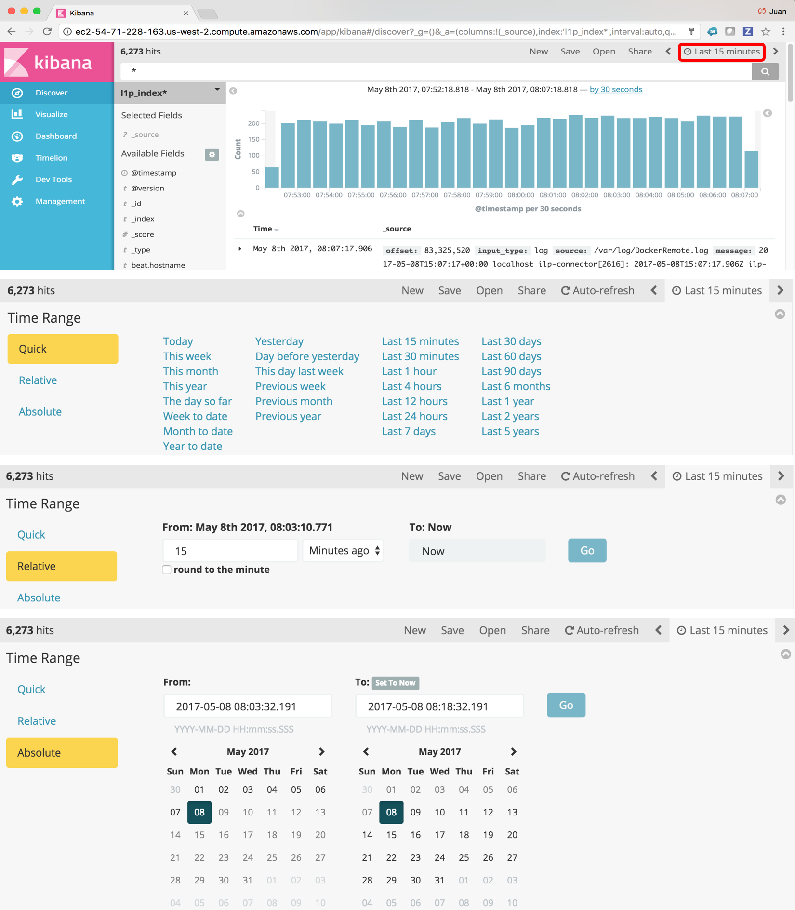
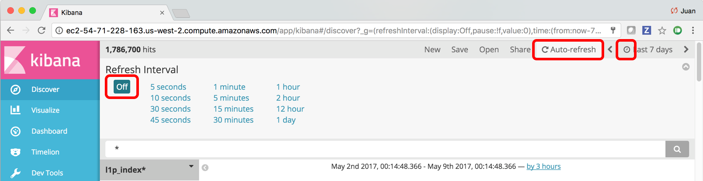
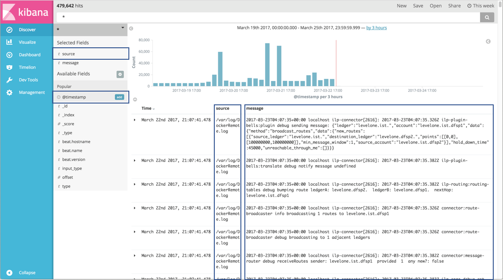
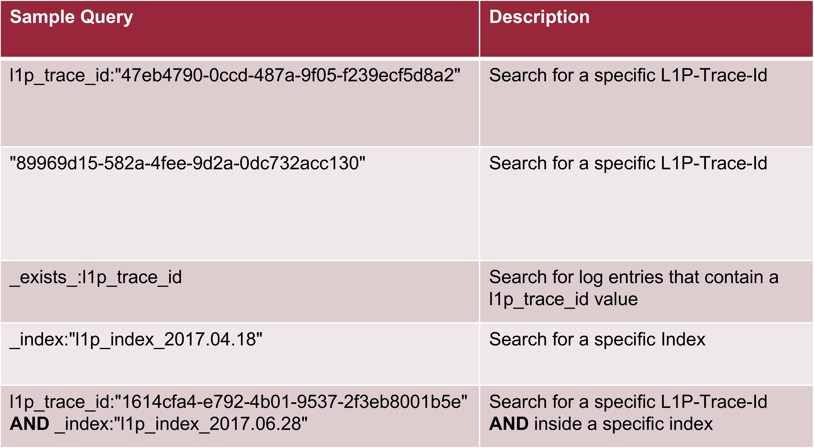
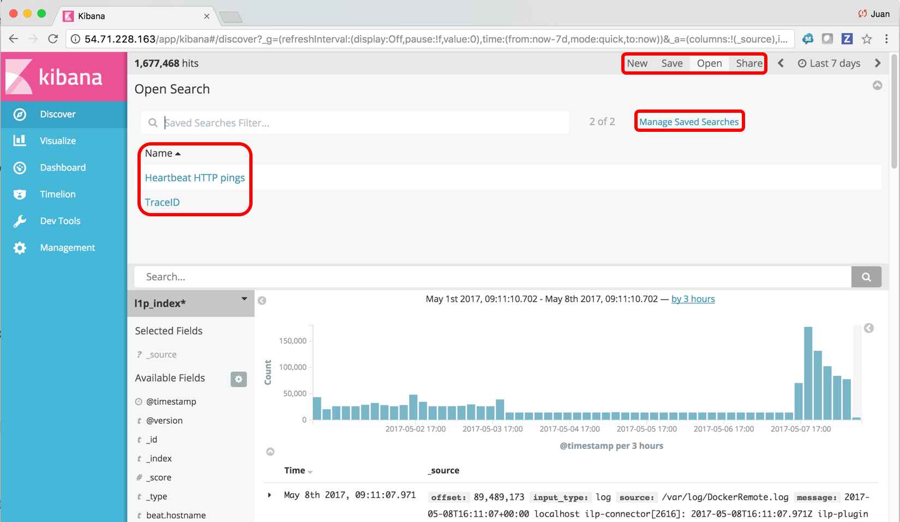
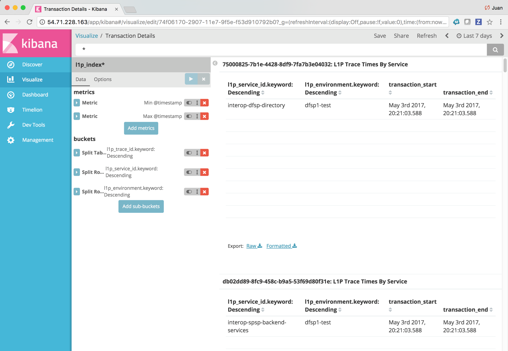

## Using Kibana

How to use Kibana, its dashboards and query language for L1P tracing and debugging purposes.

Kibana is the ELK Stack (Elastic Stack) window into the Elasticsearch data. It allows you to monitory, query, visualize and create reports on Elasticsearch data. This document is a L1P Kibana User Guide that will show how to use Kibana for the most common L1P use cases. Kibana features used at L1P projects will be described and then specific use cases will be described in detail.

### Kibana Dashboards and Visualizations

Kibana allows you to create visualizations based on the Elasticsearch data. Furthermore, Kibana allows you to create dashboards based on one or more visualizations. 

Elasticsearch data is generated by the several components:

- Logstash
- Filebeat
- Metricbeat
- Heartbeat

For the data generated by the Beats family of shippers Kibana also contains out of the box Dashboards and Visualizations. These come prepackaged as part of the given Beat family shipper. After installing the given Beats family shipper its dashboards and visualizations can be imported.

#### Dashboards Import

Following are the scripts to install the Beats family shipper dashboards:

- /usr/share/filebeat/scripts/import_dashboards
- /usr/share/metricbeat/scripts/import_dashboards
- /usr/share/heartbeat/scripts/import_dashboards

In order to access the visualization and dashboards that are imported by these scripts, go to Kibana and navigate to the Visualizations or Dashboards menu options at the left hand menu.

#### Access to Kibana via NGINX on your browser
	
http://EC2_INSTANCE_URL

### L1P Kibana Use Cases

#### How to monitor logs?

Follow the following steps:

1.	Navigate to “Discover” menu
2.	Expand Time Range, by clicking the “Time picker” icon on top right corner
3.	Set Time Range, pick between Quick, Relative and Absolute modes and set time range
4.	Enter your search criteria (e.g. L1p-Trace-Id)
5.	Perform search
6.	Review logs returned

#### How to set time range?

By default, Kibana will show you logs for the last 15 min. To set the time range from the Discover Kibana page click on the area where with the “Time picker” icon on the top right corner. This will expand the “Time Range” control panel down containing three different modes to set the time range; “Quick”, “Relative” and “Absolute” as shown in screenshots below.

#### How to enable auto refresh of search results?

Search results can be set to auto refresh, so your search results and visualizations do not contain stale data. Optionally, you can manually refresh results by clicking “Refresh”. The Auto-refresh can be enabled by clicking the “Time picker” icon, clicking the “Auto-refresh” link and then set it to on and specify the refresh rate.

#### How change to which indices you are searching?

When you submit a search request, the indices that match the currently-selected index pattern are searched. The current index pattern is shown below the toolbar. To change which indices you are searching, click the index pattern and select a different index pattern. NOTE: By default, only 1 index pattern is shown, you must click the arrow to expand the index section to show you the different indexes available.

#### How to add/remove fields from Kibana’s Discover window to monitor logs?

Navigate to the Kibana Discover page and hover over the field you would like to add/remove from the search results table and click the add/remove button.

#### How to trace a L1P transaction based on its L1p-Trace-Id?

Navigate to the Kibana Discover page and enter a search criterial like:

L1p-Trace-Id=d349c18b-e4ea-4913-b2f8-0b9dcd2f2293

#### Examples of common L1P Kibana Queries

#### Quering behaviour and rules in Kiabana:

- query behaves as unstructured text search, with some special commands, and if you get the command syntax wrong it just does an unstructured text search
- by default it searches for entries containing any or your search terms
- hyphen is consider as a delimiter
- in order to search for a string literal use double quotes NOT single quotes (single quotes are ignored)
- to search for a single filed enter field name, then a colon and then the value within double quotes
- exists and missing are examples of commands that can be used, e.g exists:exception
- AND and OR are case-senditive, must use upper case
- can use parenthesis when searching for several things, e.g. exists:exception AND ( l1p_trace_id:"1614cfa4-e792-4b01-9537-2f3eb8001b5e" OR _payment_id:"1614cfa4-e792-4b01-9537-2f3eb8001b5e"
- field names are also case-sensitive, examples of fields are l1p_trace_id and index

#### How to save a search, how to open a saved search and how to manage saved searches?

Kibana allows you to save a search criteria. From the Kibana Discover page just hit the “Save” link on the top right hand corner just before the “Time Picker” icon to save your search. To access your saved search, hit the “Open” link. To delete or edit your save search hit the “Open” link and then the “Manage Saved Searches” link.

#### How to monitor transaction duration between l1p_components?

A Kibana Visualization on top of the custom l1p_index was created for this purpose and can be accessed by navigating to Kibana Visualize page and selecting the “Transaction Details” link. NOTE: Once the trace id is contained at all component and services logs this table will correctly display the durations.

### Reference to Kibana's Official Documentation

https://www.elastic.co/guide/en/kibana/current/introduction.html
