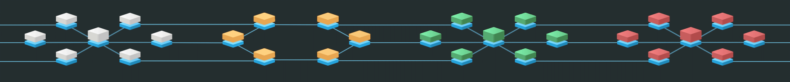
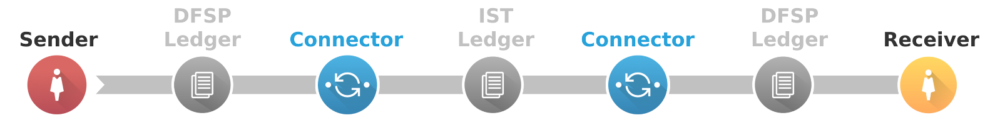
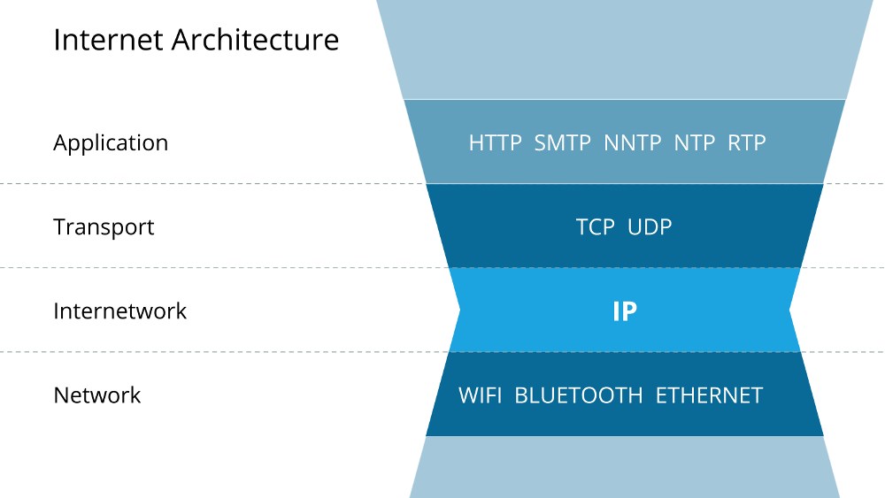
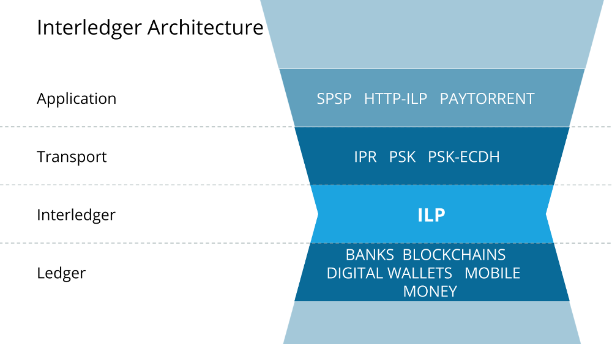
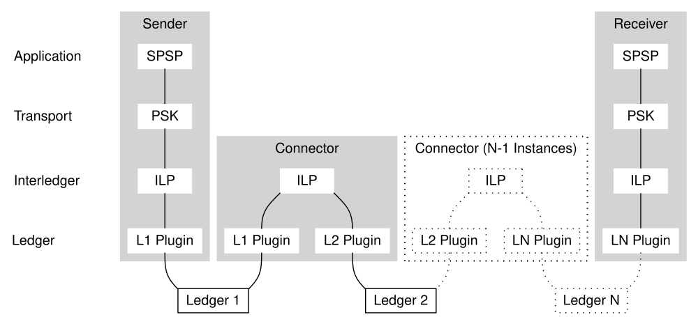
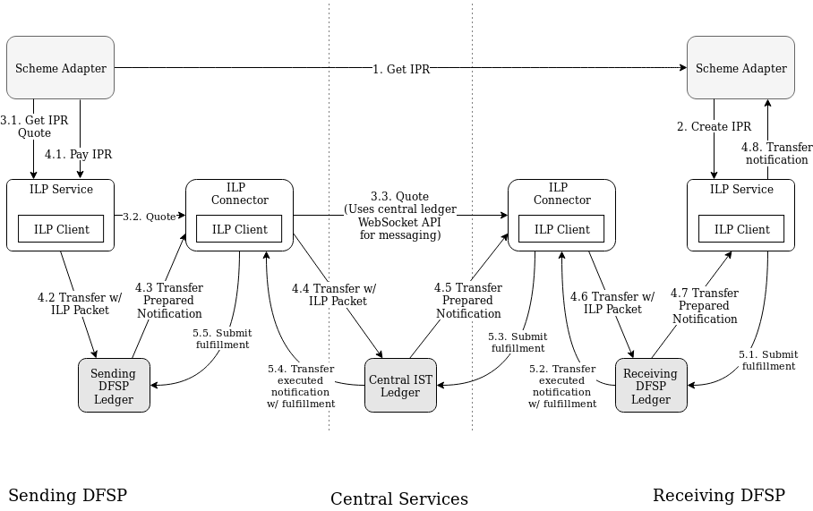
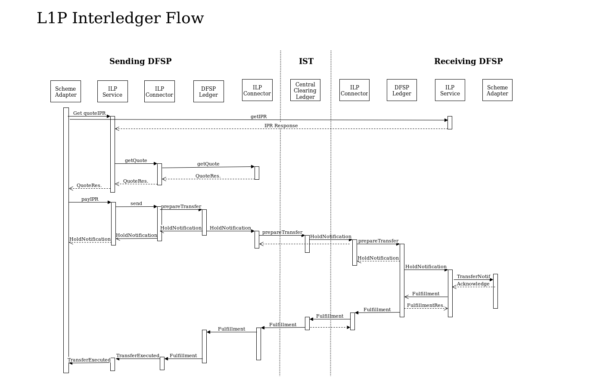

# Interledger for Mojaloop

The Interledger project is a suite of protocol definitions and reference implementations that define a standard way to connect any number of disparate payment systems together into one interconnected network: an _internet of value_. Mojaloop uses Interledger as its settlement layer so that individual instances or deployments of Mojaloop software can eventually become interconnected not just with one another, but with all other payment systems worldwide. Interledger development is spearheaded by Ripple, with support from the W3C and various other stakeholders.



_Interledger provides a standard for linking disparate payment networks to one another._

**Contents:**

- [Why Interledger](#why-interledger)
- [Core Concepts](#core-concepts)
    - [Ledgers](#ledgers)
    - [Connectors](#connectors)
    - [Cryptographic Proof](#cryptographic-proof)
    - [Foward Holds, Backwards Execution](#forward-holds-backwards-execution)
- [Protocol Layers](#protocol-layers)
- [Addresses and Routing](#addresses-and-routing)
    - [Prefix-Based Routing](#prefix-based-routing)
- [Data Formats](#data-formats)
- [Software Components](#software-components)
    - [Running the ILP Software](#running-the-ilp-software)
    - [Execution Flow](#execution-flow)

## Why Interledger

### The Right Technology

Interledger's features and capabilities closely align with Mojaloop's principles, and Interledger is the most advanced standard for interconnectivity at this time.

### For the Right Context

The Bill & Melinda Gates Foundation has observed the trends, problems, and opportunities in developing countries in the world and developed principles to guide the direction of a financial system that can benefit the most people:

- A _push payment model_ with immediate funds transfer and same-day settlement. Interledger is compatible with a push payment model and can enable settlement within seconds, depending on the limitations of the transacting parties.
- _Open-loop interoperability_ between providers. Interledger is intended to be an open standard that _anyone_ can build on, enabling innovation and interoperability without the usual boundaries
- Adherence to well-defined and adopted _international standards_. Interledger is being developed by a trans-national community with open standards, in collaboration with the W3C and other standards organizations.
- Meeting or _exceeding the convenience, cost, and utility of cash_. Interledger's open standards, incredibly fast digital settlement, and open connectivity add up to a system that can be far cheaper, faster, and more convenient than cash for a wider range of transaction values.

The two remaining principles for Mojaloop are system-wide _shared fraud and security protection_ and _identity and know-your-customer (KYC) requirements_. Interledger does not have specific provisions for either one of these, but it does not preclude participants from building systems that enforce such restrictions. In fact, Interledger has been designed on the assumption that providers of different types and in different contexts must have different restrictions and needs for fraud, security, and identity requirements. Mojaloop is spearheading one of the first sets of fraud detection and information sharing to be built into an Interledger compatible system.


## Core Concepts

### Ledgers

Interledger conceptualizes a _ledger_ as a system tracking accounts and balances in a single currency. In the real world, there are systems called "ledgers" that support multiple currencies; in Interledger parlance, each supported currency in such a system would comprise a separate "ledger". The act of sending money from one user of a given ledger to another user of the same ledger is called a _transfer_. A payment that can be executed by a single transfer within a single ledger does not need or use Interledger.


### Connectors

The Interledger project assumes that no one ledger will ever serve the whole world. Aside from the problem of scaling a ledger to serve billions of members of humanity, ledgers have different intrinsic qualities that benefit different parties; different ledgers exist today in part because their customers have not just different but _mutually exclusive_ needs and preferences. Still, people would like to be able to pay each other even if they don't use the same ledger:


_Payments that cross a ledger boundary are currently hard._

Rather than trying to create one ledger to rule them all, we should make payment systems _interoperable_. We do this by _connecting_ systems to each other, then bridging payments through multiple connectors using _[Cryptographic Proof](#cryptographic-proof)_.



_Connectors link ledgers to each other. In the L1P model, all DFSPs connect to a central ledger._

The _Connector_ is one of the core pieces of ILP software. Each connector is linked to two or more ledgers where it holds a balance, and it facilitates payments by receiving money in one ledger and paying out money in another ledger. Within a single Level One deployment, we expect that each Digital Financial Services Provider (DFSP) runs a connector pairing their home ledger to the central IST ledger, and all the ledgers are denominated in the same currency. In the greater inter-ledger world, a Connector could link two DFSPs directly, and the ledgers could be denominated in any pair of currencies; the connector sets the rate of exchange between each ledger's native currency.

### Cryptographic Proof

In traditional payments, each intermediary must be trustworthy. The more intermediaries, the higher the risk of a transaction failing partway through. Interledger solves this problem with the financial equivalent of a [two-phase commit](https://en.wikipedia.org/wiki/Two-phase_commit_protocol). Each transfer in the payment is locked by a _condition_ value and unlocked by a _fulfillment_ value that hashes to the condition. With interledger, each party only needs to trust the ledger or intermediary immediately adjacent in the chain, regardless of how long many transfers and intermediaries are involved.

To provide the least risk for users, ledgers should provide conditional hold functionality, such that a cryptographic fulfillment automatically executes a prepared transfer. Mojaloop's example ledgers all implement such systems. Interledger has some other requirements for optimal operation, including authenticated best-effort messaging between users of a ledger. For details of ledger requirements and recommendations, see [IL-RFC-17: Ledger Requirements](https://github.com/interledger/rfcs/blob/master/0017-ledger-requirements/0017-ledger-requirements.md).

### Forward Holds, Backwards Execution

The typical execution pattern of an Interledger transfer is forward holds (starting with the transfer from originator) followed by backwards execution (starting with the transfer to the beneficiary). First comes a payment planning step wherein the originator asks the beneficiary for a unique cryptographic condition to which the beneficiary knows the answer. (In Mojaloop, the DFSPs provide this functionality on behalf of their customers.) The originator starts by preparing a conditional transfer to an intermediary's account in the sending DFSP's ledger. This intermediary is a _Connector_. In the Mojaloop model, each DFSP runs a Connector service that links the DFSP's ledger to a central Interoperability Service for Transfer (IST) ledger. The Connector chooses a route and prepares a conditional transfer in a different ledger, to either another intermediary Connector or the final beneficiary. That Connector does the same, until the transfer to the beneficiary is prepared in this manner. All the transfers share the same cryptographic condition, which only the beneficiary can fulfill.

The beneficiary (or, in Mojaloop's case, the beneficiary's DFSP) notices that the incoming transfer with a known cryptographic condition has been prepared in the beneficiary's preferred DFSP ledger. The beneficiary executes this transfer by revealing the cryptographic fulfillment to the DFSP ledger; at this point the beneficiary has gotten paid. The last connector sees the fulfillment in the execution notification, then uses the same fulfillment to execute the previous transfer in the chain. This continues until the first transfer executes, debiting the originator.

Each transfer needs a timeout, or else malicious actors could trick connectors into locking up money forever by proposing transfers that won't be executed. However, with timeouts, it's possible that some transfers of a payment execute in time while other transfers expire, especially if a particular connector or ledger has an outage. The pattern of executing transfers last-to-first protects the customer: it guarantees that the money will be credited to the beneficiary or the originator will not be debited. (In the failure case, both are true.) Connectors in the middle take the risk of losing funds in the failure case, but they can choose the timeouts of each transfer and the fees for exchanging across ledgers in order to minimize the risk. For more information, see [Connector Risks](#connector-risks).


## Protocol Layers

The design of Interledger intentionally copies the design of the Internet as much as is applicable. The four Interledger layers—Ledger, Interledger, Transport, and Application—are analogous to the Data link, Network, Transport, and Application layers of the [OSI model](https://en.wikipedia.org/wiki/OSI_model). Both models revolve around a single core protocol: Internet Protocol (IP) for the OSI stack, and the Interledger Protocol (ILP) for the Interledger stack.

| Internet Stack | ILP Stack |
|----------------|-----------|
|  |  |

Another way of looking at the protocol:



The layers of the Interledger protocol stack are as follows:

| Layer | Description |
|---|---|
| [Application](#application-layer) | Application-defined protocols for planning payment. |
| [Transport](#transport-layer) | Defines standard data formats for application-layer data and cryptographic ondition generation. |
| [Interledger](#interledger-layer) | In this layer, connectors communicate with one another to plan the transfers involved in a payment. |
| [Ledger](#ledger-layer) | In this layer, senders, receivers, and connectors communicate to the ledgers involved in the payment. |


### Application Layer

The Application Layer coordinates and prepares overall payments. User-facing applications implement protocols from this layer to prepare payments with one another. At this layer, the two endpoints of a payment communicate directly with one another. In Mojaloop, the [Scheme Adapter][] implements a custom application layer protocol using Interledger Payment Request (IPR) format as the Transport layer. In the L1P's custom protocol, the two DFSP's communicate directly using HTTPS to plan a payment before preparing it.


### Transport Layer

The Transport Layer defines how payments are identified and how to generate the cryptographic conditions for the transfers in the payment. Mojaloop uses the IPR format. For the data included in this layer, Mojaloop uses the format defined by the Interledger Pre-Shared Key (PSK) specification, which resembles HTTP headers, although L1P does not use the PSK protocol itself. L1P does not encrypt the data.

Key pieces of data that are defined in this level are:

- The expiration time of the payment
- The key type used to generate the unique condition and fulfillment for this payment
- A unique nonce for the payment
- Mojaloop "Trace ID" of a payment

**Note:** Unlike the OSI model, the Interledger stack does not have a hard distinction between the "Application" and "Transport" layers; any application layer protocol is closely fixed to a particular transport layer protocol. The main point of the distinction is to make it possible to implement client libraries for transport layer functionality that can be used as generic building blocks for writing application-layer protocols.

#### More information

- [IL-RFC-11: Interledger Payment Request](https://github.com/interledger/rfcs/blob/master/0011-interledger-payment-request/0011-interledger-payment-request.md): The IPR specification
- [IL-RFC-16: Pre-Shared Key](https://github.com/interledger/rfcs/blob/master/0016-pre-shared-key/0016-pre-shared-key.md): The PSK specification, which includes the data format recommended for use with IPR

### Interledger Layer

There are two closely-related protocols in the Interledger layer: the Interledger Protocol (ILP) and the Interledger Quoting Protocol (ILQP). Connectors communicate with each other in these protocols, using ILQP to quote payments and ILP to prepare payments. (The execution happens individually for each transfer at the ledger layer.)

#### More information

- [IL-RFC-3: Interledger Protocol](https://github.com/interledger/rfcs/blob/master/0003-interledger-protocol/0003-interledger-protocol.md)
- [IL-RFC-8: Interledger Quoting Protocol](https://github.com/interledger/rfcs/tree/master/0008-interledger-quoting-protocol)

### Ledger Layer

The ledger layer is implemented by the unique, core ledgers of each system. In Mojaloop, these ledgers include each DFSP's internal ledger and the IST's central ledger. The core operations are preparing conditional transfers, executing those transfers, and sending authenticated messages to other users of the same ledger.

Each Connector must know how to use the API of the ledgers to which it is connected. Rather than having a unique API for each ledger, Mojaloop's reference implementations all use a consistent API, called the [Five Bells Ledger API][]. In the case of a DFSP that has an existing ledger API, either the DFSP must run an adapter to provide a Five Bells Ledger API, or the Connector must have a plugin for using the DFSP's own ledger API.

[Five Bells Ledger API]: https://github.com/interledger/rfcs/blob/master/0012-five-bells-ledger-api/0012-five-bells-ledger-api.md


## Addresses and Routing

Within the Interledger Protocol (ILP) layer, connectors route payments according to their internal routing tables. The destination of a given ILP payment is determined by its _ILP Address_, a hierarchical string of alphanumeric identifiers analogous to an IP address. For example, all payments to addresses starting with `private.l1p.ZZZ.dfsp1.` are routed to the connector operated by DFSP 1.

Currently, Mojaloop participants are not meant to be reachable by the general public, so they use the `private.` prefix.

The details of routing are not specified in the protocol, but the connectors used by Mojaloop follow simple longest-prefix rules with static routing tables.

ILP Addresses are specified by [IL-RFC-15: ILP Addresses](https://github.com/interledger/rfcs/blob/master/0015-ilp-addresses/0015-ilp-addresses.md).


### Address Allocation

Each DFSP needs a unique address prefix. The following guidelines establish

1. A standard prefix, `private.l1p.`
2. A country or location prefix. In most cases, this can be an [ISO 3166-1 alpha-3](https://en.wikipedia.org/wiki/ISO_3166-1_alpha-3) code. The code `ZZZ` represents demo instances. If there is any doubt, the operator of the IST chooses which code to use.
3. A unique identifier for the DFSP. The DFSP should suggest a code, and the operator of the IST should confirm that the code is not already in use by another DFSP in the same instance (that is, with the same country/location prefix). Valid characters for the DFSP's segment identifier are alphabetic (A-Z, upper or lower case, case sensitive), digits 0-9, underscore (`_`), tilde (`~`), and dash (`-`). The DFSP identifier should be kept short since the entire address has to fit in 1023 characters, including any sub-account addressing or invoicing information; a good DFSP identifier should be about 20 characters or less.

#### Example address prefix for "DFSP 1" in a test instance
 `private.l1p.ZZZ.dfsp1.`

The address of a customer account should be the DFSP's prefix and the customer's account number. (It's acceptable to have additional dot-separated segments after the account number to indicate more information about the purpose or destination of a payment.)

#### Example customer account address for a "medical benefits" sub-account
`private.l1p.ZZZ.dfsp1.849702568.medical`


## Data Formats

Interledger standards are defined using Abstract Syntax Notation One (ASN.1) as defined in ITU X.680 and encoded with Octet Encoding Rules (OER) as defined in ITU X.696. By relying on ASN.1 we can take advantage of highly sophisticated tooling which allows us to verify the integrity of our specifications and the correctness of our implementations. By encoding with OER we ensure that parsers are very simple to write, wire formats are compact and encoding/decoding performance is excellent.

## More information

- [ASN1 Introduction](http://www.oss.com/asn1/resources/asn1-made-simple/introduction.html)
- [OER Overview](http://www.oss.com/asn1/resources/books-whitepapers-pubs/Overview%20of%20OER.pdf).
- [Repository of Interledger ASN.1 modules](https://github.com/interledger/rfcs/tree/master/asn1)


### PSK Data Format

The _PSK Data Format_ is a data structure closely resembling [HTTP headers](https://www.w3.org/Protocols/rfc2616/rfc2616-sec4.html#sec4.2), defined for use with the PSK Interledger protocol. The same data format is used in the reference implementation of the IPR transport layer and in Mojaloop, because it provides some convenient properties. For example, it provides a public headers section so that all connectors in the middle of a payment can

### ILP Packet

The ILP Packet is a binary data structure that should be attached to transfers (as a memo, if possible) to connect them to an Interledger payment.

- The [Interledger address](#addresses-and-routing) of the account where the payment should ultimately be delivered
- A 64-bit unsigned integer amount, with the scale and currency defined by the ledger where the amount is to be delivered
- An arbitrary, opaque, variable-length binary data field

#### More information

- [ILP Packet Definition](https://github.com/interledger/rfcs/blob/master/0003-interledger-protocol/0003-interledger-protocol.md#ilp-payment-packet-format)

### ILP Error Format

The ILP Error Format is a binary data structure that Interledger components use to indicate a problem with executing a payment in the Interledger layer. The error format includes an error code, which is inspired by HTTP status codes, where the prefix specifies a broad category of causes and the number specifies the exact error that occurred. To distinguish Interledger error codes from HTTP status codes, Interledger errors use a letter prefix instead of a number. For example, temporary interledger errors use the prefix "T"—this is similar to HTTP status codes in the 500 range.

#### More information

- [ILP Error Format](https://github.com/interledger/rfcs/blob/master/0003-interledger-protocol/0003-interledger-protocol.md#ilp-error-format)

### Amounts

In the Interledger layer, amounts are always represented as 64-bit unsigned integers. This provides extremely predictable precision and rounding behavior. Interledger amounts cannot be negative because you cannot transfer a negative value. (That would be the equivalent of a pull payment in a push payment system.) The amount is always defined in the context of a particular ledger, specifically, the one where the receiver's address is located. Each ledger's interface must define a translation from its internal data format to a 64-bit unsigned integer. In the [Five Bells Ledger API][], the **Get Metadata** method handles this by reporting the currency and scale of that currency.

Two ledgers may choose different scales for representing the same currency, depending on their intended use case. For example, a ledger optimized for micropayments might have a "nanodollar precision" with a minimum amount of 10^-9 USD, while a traditional bank might set the limit at "millidollar precision" such that the minimum amount is 10^-3 USD ($0.001). In the nanodollar precision ledger, 2 USD would be represented as `2000000000` while in the millidollar precision ledger 2 USD would be `2000`. Interledger's 64-bit unsigned integer can fit very large numbers without losing precision. For example, a payment in the amount of the gross national product of the USA in 2015 (18.14 trillion purchasing-parity dollars) could be represented down to the level of 10^-6 dollars ($0.000001) without rounding. In the unlikely event that a payment requires more precision than a 64-bit integer can provide, it could be divided into two Interledger payments to different ledger prefixes that represent different scales.

In JSON data, Interledger amounts should be represented as decimal strings. Many JSON parsers assume JSON numbers have the same precision as JavaScript numbers (64-bit double-precision floating point), which cannot represent all unsigned 64-bit integers without losing precision. By representing amounts as strings, senders and receivers of JSON can serialize and deserialize the amounts using data types that can represent the full precision, or at least as much precision as is necessary for their specific purposes.


## Connector Risks

Interledger guarantees that the receiver gets paid or the sender gets their money back. There are, however, some failure cases where connectors in the middle could lose money because a transfer expired before the connector could execute it. (In those cases, the receiver gets paid _and_ the sender gets their money back, thanks to the backwards execution.) To balance out these risks, connectors should plan accordingly.

[IL-RFC-18: Connector Risk Mitigations](https://github.com/interledger/rfcs/blob/master/0018-connector-risk-mitigations/0018-connector-risk-mitigations.md) discusses general patterns connectors can follow to minimize their risk of losing money.

In the case of a Mojaloop instance, some more specific modifications are possible to further mitigate risk. These are possible because Mojaloop design involves a trusted central ledger, and each DFSP has control over its ledger _and_ connector. These optimizations are, in short:

- _Receiver Wait & Pay_ — The receiving DFSP tries to fulfill the transfer on the central ledger before preparing the transfer to the final receiver.
- _Sender Check-before-Rollback_ — The sending DFSP checks the outcome of the transfer on the central ledger shortly after that transfer expires. The sending DFSP sets the timeout of the transfer in its own ledger such that it can execute the transfer (including possible retries) after seeing the outcome on the central ledger.
    - Or the sender checks the result on the central ledger before expiring a transfer in the sending DFSP's ledger. If the transfer succeeded on the central ledger, the sender executes the transfer on the sender's DFSP ledger even if that means the transfer in the sending DFSP's ledger executes at or slightly past its expiration time.


## How to Troubleshoot ILP Payment Issues

- Consult the logs.
- See which transfers executed and which transfer oe transfers failed.


## Software Components

Components appear and are described in the following diagram and table.




| Component Name     | Summary                                                 |
|:-------------------|:--------------------------------------------------------|
| [Scheme Adapter][] | A custom application defined by Mojaloop that handles the planning of payments on an end-to-end basis. |
| [ILP Service][]    | A RESTful service that acts as a client library for accessing ILP-related functions, such as getting quotes from the ILP Connector, generating conditions in IPR format, and similar tasks. |
| [ILP Client][]     | A common library used within the ILP Service and the ILP Connector. |
| [ILP Connector][]  | Holds money in the DFSP ledger and the Central Ledger, and sets the rates of exchange between them. |
| [DFSP Ledger][]    | The reference ledger for a DFSP. Tracks customer balances and exposes the [Five Bells Ledger API][]. |
| [Central Ledger][] | The reference ledger for a central IST. Tracks DFSP / connector balances and exposes the [Five Bells Ledger API][]. |

[DFSP Ledger]: ../DFSP/README.md
[Central Ledger]: ../CentralLedger/README.md

### Scheme Adapter
[Scheme Adapter]: #scheme-adapter

A custom application defined by Mojaloop that handles the planning of payments on an end-to-end basis. Part of the DFSP software.

#### More information

- [Scheme Adapter Repository](https://github.com/mojaloop/interop-scheme-adapter)

### ILP Service
[ILP Service]: #ilp-service

A convenience application for Mojaloop that provides a handful of ILP-related functions through a RESTful(-ish) API. Functionality includes getting quotes, creating Interledger Payment Request objects (which include the cryptographic conditions), and issuing notifications when the connector detects that ILP-compatible transfers have been prepared.

#### More information

- [ILP Service Repository](https://github.com/mojaloop/ilp-service)

### ILP Client
[ILP Client]: #ilp-client

This is a standard library used by the ILP Service and the ILP Connector. It handles things like validating and verifying [Crypto-Conditions][]. It interfaces with the ILP Connector using the Interledger Protocol and the Interledger Quoting Protocol. It also interfaces with the reference DFSP ledgers and central IST ledger using the [Five Bells Ledger API][], and can be extended with plugins for other ledger interfaces.

#### More information

- [ILP Client Repository](https://github.com/interledger/js-ilp)
- [Five Bells Ledger Plugin Repository](https://github.com/interledger/js-ilp-plugin-bells)

### ILP Connector
[ILP Connector]: #ilp-connector

The ILP Connector connects one DFSP's Ledger to another ledger. For now, a DFSP's connector always connects the DFSP to the Central Ledger. In the future, it is possible that ILP Connectors could connect two DFSP ledgers directly, and there could even be a competitive marketplace of ILP Connectors between pairs of ledgers.

The ILP Connector has accounts holding money with the ILP Ledger Adapters of each of the two ledgers it connects. (It can also connect directly to ledgers that implement ILP natively.) The connector defines the exchange rates between balances on the two ledgers.

Mojaloop uses the Interledger project's reference implementation for a connector.

#### More information

- [ILP Connector Repository](https://github.com/interledger/five-bells-connector)

### Running the ILP Software

[Ansible](https://docs.ansible.com/ansible/playbooks.html) is used for deploying the [`ilp-connector`](https://github.com/interledgerjs/ilp-connector) and the [`ilp-service`](https://github.com/mojaloop/ilp-service). The [Ansible Playbook](./ansible/ansible.yml) can be run with the command:

```sh
ansible-playbook -v --extra-vars="docker_username=<FILL ME IN> docker_password=<FILL ME IN> docker_email=<FILL ME IN>" --inventory-file=hosts-test ansible.yml
```

This command should be run from the [ansible](./ansible) directory in this repository.

Ansible uses the SSH keys found in your normal SSH directory to log in to the servers.

The Docker credentials are those used for the private registry (modusbox-level1-docker.jfrog.io).

The Inventory File should either be the [hosts-test](./ansible/hosts-test) or [hosts-qa](./ansible/hosts-qa) depending on whether you want to deploy the components to the L1P Test or QA environment.

### Execution Flow

Execution flow is shown in the following diagram.


