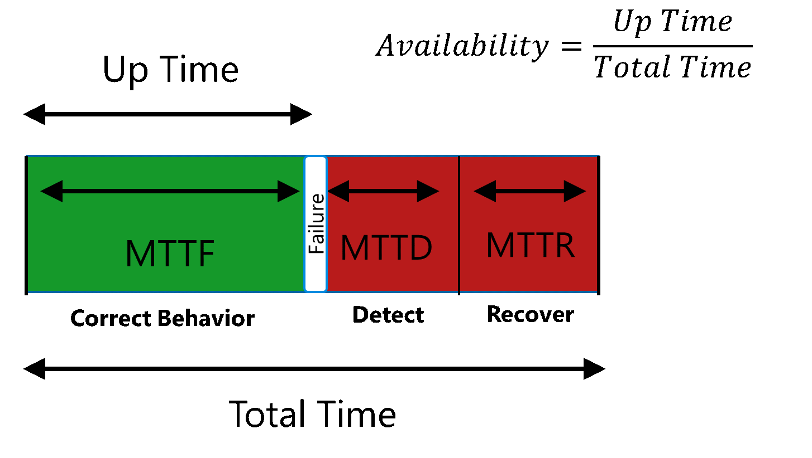
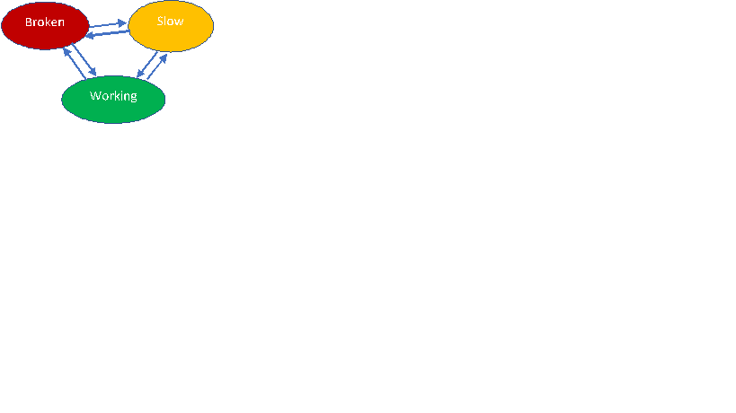

# Resilience Modeling and Analysis


[Wikipedia](https://en.wikipedia.org/wiki/Failure_analysis): "Failure
mode and effects analysis (FMEA) . . . was one of the first systematic
techniques for failure analysis. "

When FMEA is applied to software services it is called **Resilience
Modeling and Analysis** (RMA), see [white
paper](https://www.google.com/url?sa=t&rct=j&q=&esrc=s&source=web&cd=2&cad=rja&uact=8&ved=0ahUKEwjd4saxtvLTAhUGzGMKHRnUCe0QFggtMAE&url=http%3A%2F%2Fdownload.microsoft.com%2Fdownload%2F7%2F8%2F7%2F78716493-0876-4CDF-8595-F5EEE13FD0E1%2FResilience_by_Design_for_Cloud_Services_Strategy_Brief.pdf&usg=AFQjCNEoHGF3lAAEda-8In_MaWR9Hd8IFA&sig2=X7A1pw9ai9nhH3aYWJ8McQ).

It was developed by reliability engineers in the late 1950s to study
problems that might arise from malfunctions of military systems.

FMEA can be applied directly to software services to identify and rank
possible service failures. Once identified, there are standard
mitigation and testing patterns can be applied to resolve each failure.
This process is used to prevent major failures and reduce downtime.

# What RMA is

Resilience modeling assumes that there will be failures in a system. It
doesn't focus on increasing reliability, which is measured below as mean
time to failure (MTTF), instead if focuses on reducing time to detection
and recovery (MTTD and MTTR). By reducing time to detection and time to
recovery (the red area below), availability (the green area) is
maximized.



Figure - Availability from MTTF, MTTD, and MTTR

For RMA, developers look at the architecture data flows and ask: "what
could go wrong here, how bad will that be, and how often will that
happen?" RMA provides a prioritized list of potential faults. We extend
RMA to add one or more ways to detect, mitigate, and test the handling
for each of those faults.

RMA is a very similar process to threat modeling except that instead of
looking for threats, we look for faults and instead of using a threat
acronym like STRIDE we use DIAL:

-   **D** - Discovery: name resolution, configuration
-   **I** - Incorrectness: corruption, version mismatch, sequence errors, duplicates
-   **A** - failure of Authorization or Authentication
-   **L** - Latency; slow or no response, flooding, deadlocks, metering, timeouts

# Standard Microservice Resilience Patterns

Because Mojaloop follows a microservices architecture there
are a group of standard potential failures that all such services have.
Because every microservice has the same issues, these issues can be
grouped together by failure mode along with standard methods of
detection, mitigation, and testing.

When we apply DIAL to microservices, we find several standard patterns
for failure.

## Failure Pattern \#1 - Low Resources


A low resource condition is common to all software. It has the advantage
that you can often detect and correct the problem before the failure
occurs.

Example failures:

-   Low memory
-   Low disk space
-   Excessive CPU
-   Peak network traffic

**Detection**

Use a system monitoring tool (Ex: AWS, Nagios, App Analytics, Sensu, New
Relic, SCOM, etc.)

Two stages:

1.  Yellow: Raise event when resource is getting low and before it's a
    problem

2.  Red: Alert when the resource is critically low or gone

For each microservice we create a table. Here's an example:

  **Resource**  | **Green**                                    |**Yellow**                    |**Red**
  --------------| -------------------------------------------- |----------------------------- |-----------------------------
  **CPU**       | &lt;80%                                      |&gt;80%, 1-minute average     |&gt; 95%, 10-minute average
  **Disk**      | &lt;80% full                                 |80 to 95% full                |&gt; 95%
  **Memory**    | &lt;80% available memory utilized            |80 to 95%, 3-minute average   |&gt; 95%, 5-minute average
  **Network**   | &lt;80% network, capacity 5-minute average   |80 to 95%, 5-minute average   |&gt; 95%

In Mojaloop, we make use of the ELK stack and Metricbeats
for gathering system data. This makes the data available to any number of
alerting systems.

**Mitigation**

Graceful degradation: system continues to function, but some
functionality may temporarily stop. As an example, in our case, new
money transfer prepare requests might be slow or rejected while the services processes existing fulfillment work.

**Fault Injections**

There are many standard tools to fill disk space, allocate large amounts
of memory, hog CPU cycles, and throttle the network.

## Failure Pattern \#2 - Service is down

Example Failures:

-   Microservice down
-   Mule down
-   DB/SQL down

**Detection**

In our case, each microservice implements a health endpoint which
returns an http 200 if the service is up. Microservice may implement a
JSON return to indicate that the service is degraded (yellow/warning
status). The health service works by doing a simple internal check of
the service.

We use the free Mule runtime which can be extended on-site for a license
fee for monitoring and dashboards to cover this or another monitoring
service may be used.

Service failures also are detected by a calling service when that
service receives a connection failure (ex: 404). This works for
dependent services that don't implement a health service. These failures
are logged and picked up by the logging engine (ELK stack) where they
can be integrated with a monitoring service.

**Mitigations**

If service down is detected, the first mitigation is to restart the
service. We use ansible playbooks for service startup.

Restart the service in a known good configuration. We use Ansible
playbooks to deploy and configure the services. These can be run to
redeploy and restart all the stateless services or restart the stateful
ones. Restarting the service should generate a configuration change
event.

Additional failover processes may be deployed in production.

The monitoring service should alert an operator when the service has
been down for a threshold amount of time.

**Fault Injections**

Stop the service

## Failure Pattern \#3 - Health Modeling


### What is Health Modeling?

[Health
modeling](https://msdn.microsoft.com/en-us/library/ms954618.aspx?f=255&MSPPError=-2147217396)
is included here as a part of resilience, but it has a larger role in
helping operations maintain the service. Health modeling answers. "what
state is the service in, and what action can I take to correct it". In
services, a health model defines a pattern that typically looks like
"check the service state, attempt to fix it automatically if it's
broken, alert the operator if we can't"

The first part of heath modeling is defining the actionable states of
the system.

A very simple health model might have three states: broken, slow, and
working. The most general form of this model is a finite state model or
petri net showing the three states and all possible transitions between
them:

where the transitions are typically events that come from log events or
health checks. Ex: The transition from Working to Broken might be
"health check doesn't return 200".

In a simple model like this one, where the severity of the problems can
be stack ranked, it's easy  to model the system as a chain of
responsibility pattern:

```
If (health state doesn't return 200) then broken

if (health state returns 200 with "slow" in JSON) then slow

else working
```

This kind of pattern is very easy to code and test. You can have any
number of if/then statements in this kind of model, and multiple
consecutive statements can lead to the same state. State checks are
ordered from worst outcome to best. If any statement is true, the chain
stops.

The second part of the health model is recovery process. This is also an
ordered set of operations that can be shown as one or more chain of
responsibility patterns - either for the entire system or for a group of
states within it. Example:

```
if (broken for more than 5 minutes) alert operator

If (broken for more than 2 minutes) then raise event and run Ansible playbook to redeploy service

If (broken) then raise event and run Ansible playbook to restart service

if (slow and # of services > N) then alert operator

if (slow) then raise event and run playbook to add additional microservice

if (working and more than 1 service and a service is idle) then run playbook to scale down services
```

Describing the actions like this makes it easy to automate the responses
and understand what should happen when problems occur.

# A General Microservice Health Model

An advantage of microservices is that every microservice has the same
kinds of possible states and transitions. A general health model can
apply to most of the operations in any microservice. Once we have that
model we only need to worry about special cases specific to our service.

Our simple health model has only four states (in order):

-   **Stopped** - the service is stopped or unresponsive
-   **Misconfigured** - a catch-all state for something has gone wrong
    that the code can't automatically fix. We don't support
    auto-rollback of a new deployment, but If you want to you can add
    "Mis-deployed" state above this one to cover the case where a new
    deployment has been done N minutes ago yet is still in the
    misconfigured state.
-   **Slow** - performance is below an acceptable threshold
-   **Working**

The main difference between the simple health model example above and
our model is the addition of the misconfigured state. Below are details
for handling each state.

#### Stopped Service

Example Failures:

-   Microservice down
-   Mule down
-   DB/SQL down

**Detection**

In our case, each microservice implements a health endpoint which
returns an http 200 if the service is up. Microservice may implement a
JSON return to indicate that the service is degraded (yellow/warning
status). The health service works by doing a simple internal check of
the service. We use the free Mule runtime which can be extended on-site
for a license fee for monitoring and dashboards to cover this or another
monitoring service may be used.

Service failures also are detected by a calling service when it receives
a connection failure (ex: 404). This works for dependent services that
don't implement a health service. These failures are logged and picked
up by the logging engine (ELK stack) where they can be integrated with a
monitoring service.

**Mitigations**

```
    If the service has been down for N + M minutes alert an operator
    Else, restart the service using an ansible playbook
```

Additional failover processes may be deployed in production. Restarting
the service generates a configuration change event.

**Fault Injection**

Stop the service to test that the service will be restarted.

#### Configuration error examples

Many possible failures lead to the misconfigured state. In all cases,
the configuration error detection can come from a logged message since
the service is running and logging, it's just not communicating. That
message should have a log type to indicate that there's a config error.
The type of checks will depend on what communication methods the
microservices supports. Here's a list:

> **Http**

-   Auth: major security failure. Unable to call upstream service and/or
    all clients can't get data
-   Misconfigured URL
-   Misconfigured network
-   API version mismatch

> **Web sockets**

-   Multiple clients on same socket
-   Port not open or configured (ex: in Docker)
-   Socket not configured (DFSP initiates)
-   Major version mismatch
-   client access auth failure - client service logs config error
-   error on notify - receiver logs error (we may consider retries here before failing)

> **SQL**

-   Misconfigured Connection string
-   Misconfigured network

> **General** - infrastructure version incorrect (ex: OS, Docker,
> JScript)

Besides all the config failures, it can be helpful if the service has a
"configuration good" log event that gets fired after startup or a
configuration change. This allows the model to know when a state has
returned to "working". Since we deal with configuration problems
manually, this is not required, but in an automated setup it would be
needed.

**Detection**

-   Run a scheduled test to ping the health service
-   Listen for actionable log messages marked with the configuration
    type

**Mitigation**

Use the mitigations above for restarting the service, but add this check
in the middle:

-   If the service has been down for N minutes. Use an Ansible playbook
    to redeploy and configure the service. A stateful service can be
    also reinstalled, but leaving the existing data volume untouched.

**Fault Injections**

-   Change Http or socket config
-   Change client or server auth
-   Force update of component to incorrect version or configuration

#### Slow Service

If performance is below an acceptable threshold the health state will
return that. The model here follows the example above

**Detection**

-   if (health state returns 200 with "slow" in JSON) then slow

**Mitigation**

```
-   if (slow) then raise event and run playbook to add additional
    microservice
-   if (working and more than 1 service and a service is idle) then run
    playbook to scale down
```

**Fault Injection**

-   Use a tool to load the processor

# Mojaloop Specific Health Modeling

Mojaloop has two additional potential faults that need to be
addressed that could cause a participating DFSP to lose money. These are 
*overloaded ledgers* and *dropped messages*.

## Overloaded Ledger 

Example: Payer sends \$100. Payee DFSP agrees and starts fulfilment. 
The payer ledger is overload and doesn't resolve the transfer in time, 
however, it's been fulfilled by the payee DFSP and the center. 
Payer DFSP losses \$100 during settlement. 

A similar problem happens if the central ledger doesn't resolve the transfer. Then the payee DFSP can be out the \$100 during settlement.

**Detection**

Track remaining time on all transfers. If a transfer is not reported 
before the timeout window (either fulfilled, rejected, or cancelled), then
it's delinquent and needs to be checked on.

**Mitigation**

1) Thread priority: Ledgers handle fulfillments before preparing new transfers.
2) Query on timeout: If payer DFSP hasn't explicitly heard a "fullfil", "reject", or "cancel" message at the end 
of a transfer timeout, it queries the center to get the current status of the transfer. 
The payee DSFP can check the status at anytime, such as before a settlement window or 
on restart of it's services after a failure.

Extending this pattern: This solution treats the central ledger as the source of truth. It can be extended to multiple 
hubs where the transfer goes through many hops before getting to the final destination. This works following
an eventual consistency model the same as above but with multiple central hubs. Each central hub acts exactly
the same way and uses the same transfer ID for the transfer. At the end of a timeout, 
if any participant doesn't know the status, they check and retry the next participant up the chain. 
Whenever and participant changes a ledger they send status both up and back down the chain. 
On the downside, they should get a corresponding change notification. If that doesn't happen they retry. 

**Fault Injection**

Take down the payee ledger adapter

## Messages dropped
As with the ledger overload problem, if the ledger notifications are
missed or dropped the payer or payee ledger can lose money. 

**Detection**
1. Payer DFSP detects when no message is received within the timeout
2. Payee DFSP doesn't recieve an ACKnowledge and fulfillment notification from the central ledger.

**Mitigation**
1) Query on timeout: The payer DFSP can resolve this with the same mechanism as an overloaded ledger. 
2) Wait for Notify Fulfillment message: The payee DFSP would lose money if it fullfils a transfer, but doesn't deliver
the notification of it to the central ledger. To mitigate this, the payee DFSP doesn't 
notify the payee or hand any money out until it recieves an fulfillment notification from the central ledger. The payee DFSP
can choose to check on a transfer status with the center, but it is not recommended to do
this for every transfer. 
3) Retries (w/idempotent writes): the ILP-Connector may retry fulfillment messages automatically (opt-in) if 
there's no response. For this to work properly, the ledgers must implement idempotent writes on the
transfer ID.

**Fault Injection**

Drop/block the fulfillment notifications
